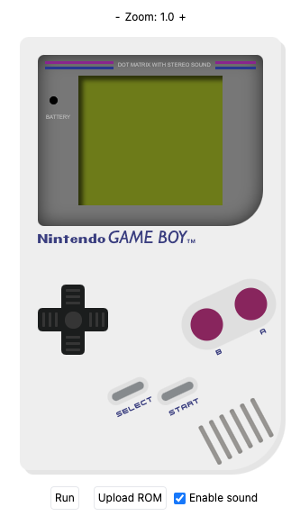
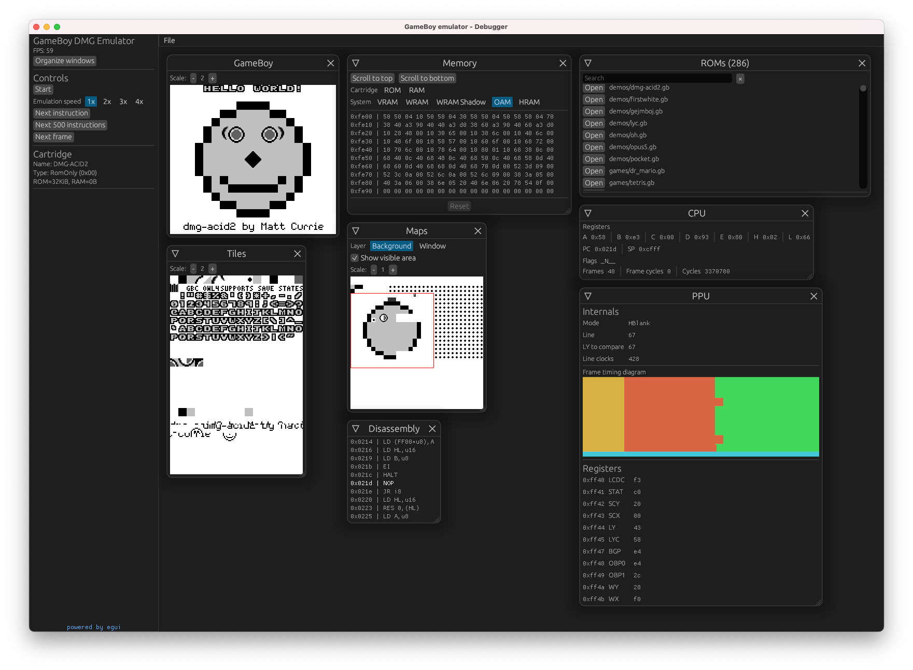

  <h1> FeatherGB</h1>
  Just another GameBoy emulator written in Rust 🦀

  

    
  

  

    
  

## Info

This is my first project in Rust, so many patterns might not be ideal. I also wanted to try WebAssembly a little bit.

## Status

The emulator is somehow accurate - the CPU is cycle accurate and the emulator passes many tests, although the PPU's accuracy needs to be improved a lot. For more info see tests results below.

## Test results

The emulator is tested against popular test suites such as [blargg's test](https://github.com/retrio/gb-test-roms), [mooneye's tests](https://github.com/Gekkio/mooneye-gb/) etc.
These test suites are linked as git submodules (see `.gitmodules` file for details).

Generated test report is [here](./docs/results/results.md)

## Modes

The emulator can be run in 2 modes - the normal mode (shows just GameBoy's display) and the debugger mode (using [egui](https://github.com/emilk/egui)). Both are available for the desktop and the browser.

### Desktop

- Standard - rendered by SDL2 (should be cross platform, but I've tested only MacOS)
- Debugger - rendered by egui (using glium as backend)

### Browser

Based on React & TypeScript in general

- Standard - WebAssembly with some stylesheets
- Debugger - WebAssembly with egui (using webgl as backend)

## TODOs

No specific priority here

- standard (play) mode
  - support for custom controls + gamepad
- APU
  - audio + video synchronization
  - channel 4 implementation
- FIFO & Fetcher for sprites
- save & load
- make PPU more accurate
  - pass all [wilbertpol's tests](https://github.com/Amjad50/mooneye-gb)
  - pass some [mealybug-tearoom-tests](https://github.com/mattcurrie/mealybug-tearoom-tests)
- memory bus conflicts
- GameBoy Color support
  - implement HDMA & GDMA

## Project structure

- `/gb` - GB emulator core (Rust)
- `/debugger` - debugger core with egui (Rust)
- `/desktop` - desktop version of debugger using glium (Rust)
- `/debugger-web` - browser version of debugger using wasm (Rust)
- `/browser` - frontend SPA
- `/integration-tests` - ROM tests

## Resources

### Links

- General GB documentation https://gbdev.io/pandocs/
- PPU details https://hacktixme.ga/GBEDG/
- opcode table https://izik1.github.io/gbops/
- Memory banks https://github.com/Gekkio/gb-ctr
- PPU interrupts timing https://github.com/AntonioND/giibiiadvance/blob/master/docs/TCAGBD.pdf
- Audio + video sync tips https://near.sh/articles/audio/dynamic-rate-control
- Audio basics https://nightshade256.github.io/2021/03/27/gb-sound-emulation.html
- Audio overview https://gbdev.gg8.se/wiki/articles/Gameboy_sound_hardware
- PPU fetcher timing http://blog.kevtris.org/blogfiles/Nitty%20Gritty%20Gameboy%20VRAM%20Timing.txt

### Test Roms

- The famous Mooneye tests https://github.com/Gekkio/mooneye-gb/
- Wilbertpol's tests https://github.com/Amjad50/mooneye-gb
- Mealybug Tearoom Tests (aka PPU torture tests) https://github.com/mattcurrie/mealybug-tearoom-tests
- DMG ACID2 test https://github.com/mattcurrie/dmg-acid2
- various tests from Optix https://github.com/Hacktix/scribbltests
- various window tests from Expo https://github.com/Powerlated/TurtleTests/

### Fonts

- Nintendo - Pretendo - https://fontmeme.com/fonts/pretendo-font/
- GameBoy - Gill Sans - https://www.myfonts.com/fonts/mti/gill-sans/
- DMG Buttons - NES Controller - https://www.deviantart.com/mrshrike/art/NES-Console-Controller-Font-141383845

### Images

- Feather icon - https://iconape.com/cape-feather-super-mario-world-logo-logo-icon-svg-png.html
- Gameboy icon - https://graphicburger.com/80s-gadgets-40-free-icons/
