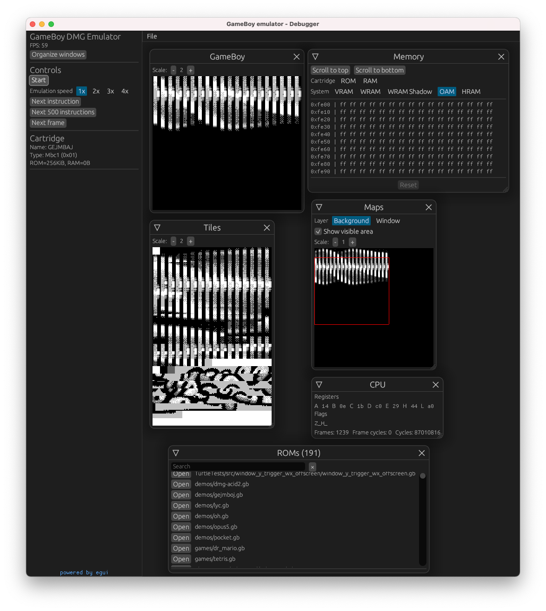

<h1>FeatherGB</h1>
Just another GameBoy emulator written in Rust 🦀.

## Modes

The emulator can be run in 2 modes - the normal mode (shows just GameBoy's display) and the debugger mode (using amazing [egui](https://github.com/emilk/egui)). Both are available for the desktop and the browser.

### Desktop

- Standard - **WIP** rendered by SDL2 (should be cross platform, but I've tested only MacOS)
- Debugger - rendered by egui (using glium as backend)

### Browser

Based on React & TypeScript in general

- Standard - **WIP** WebAssembly with some stylesheets
- Debugger - WebAssembly with egui (using webgl as banckend)

## Test results

The emulator is tested against popular test suites such as [blargg's test](https://github.com/retrio/gb-test-roms), [mooneye's tests](https://github.com/Gekkio/mooneye-gb/) etc.
These test suites are linked as git submodules and can be found in `.gitmodules` file.

Generated test report is [here](./docs/results/results.md)

## TODOs

- standard (play) mode
- allow to open custom ROM file
- APU (currently with no sound)
- make PPU more accurate and pass some [mealybug-tearoom-tests](https://github.com/mattcurrie/mealybug-tearoom-tests)
- GameBoy Color support

## Project structure

- `/gb` - GB emulator core (Rust)
- `/debugger` - debugger core with egui (Rust)
- `/desktop` - desktop version of debugger using glium (Rust)
- `/debugger-web` - browser version of debugger using wasm (Rust)
- `/browser` - frontend SPA
- `/integration-tests` - ROM tests
