# Test results

Passing **600 out of 693** tests (86.6%).

| Suite                                                    | Passed      | %         | Status |
| -------------------------------------------------------- | ----------- | --------- | ------ |
| [Blargg's tests](#blarggs-tests)                         | 17/17       | 100.0%    | ✅     |
| [Blargg's tests - dmg_sound](#blarggs-tests---dmg_sound) | 9/12        | 75.0%     | ❌     |
| [Mooneye Test Suite](#mooneye-test-suite)                | 93/98       | 94.9%     | ❌     |
| [Wilbertpol's tests](#wilbertpols-tests)                 | 39/39       | 100.0%    | ✅     |
| [acid2 tests](#acid2-tests)                              | 2/2         | 100.0%    | ✅     |
| [Scribbltests](#scribbltests)                            | 5/5         | 100.0%    | ✅     |
| [TurtleTests](#turtletests)                              | 2/2         | 100.0%    | ✅     |
| [MBC3-Tester](#mbc3-tester)                              | 1/1         | 100.0%    | ✅     |
| [Mealybug Tearoom Tests](#mealybug-tearoom-tests)        | 18/24       | 75.0%     | ❌     |
| [AGE test suite](#age-test-suite)                        | 8/11        | 72.7%     | ❌     |
| [gbmicrotest](#gbmicrotest)                              | 406/482     | 84.2%     | ❌     |
| **Total**                                                | **600/693** | **86.6%** |        |

## Blargg's tests

Source: https://github.com/retrio/gb-test-roms

Some tests are skipped, see `should_collect` in `blarggs_tests.rs` for the reasons.

**Passed 17/17 (100.0%)**

| Test                                                             | Status |
| ---------------------------------------------------------------- | ------ |
| roms/gb-test-roms/cpu_instrs/cpu_instrs.gb                       | ✅     |
| roms/gb-test-roms/cpu_instrs/individual/01-special.gb            | ✅     |
| roms/gb-test-roms/cpu_instrs/individual/02-interrupts.gb         | ✅     |
| roms/gb-test-roms/cpu_instrs/individual/03-op sp,hl.gb           | ✅     |
| roms/gb-test-roms/cpu_instrs/individual/04-op r,imm.gb           | ✅     |
| roms/gb-test-roms/cpu_instrs/individual/05-op rp.gb              | ✅     |
| roms/gb-test-roms/cpu_instrs/individual/06-ld r,r.gb             | ✅     |
| roms/gb-test-roms/cpu_instrs/individual/07-jr,jp,call,ret,rst.gb | ✅     |
| roms/gb-test-roms/cpu_instrs/individual/08-misc instrs.gb        | ✅     |
| roms/gb-test-roms/cpu_instrs/individual/09-op r,r.gb             | ✅     |
| roms/gb-test-roms/cpu_instrs/individual/10-bit ops.gb            | ✅     |
| roms/gb-test-roms/cpu_instrs/individual/11-op a,(hl).gb          | ✅     |
| roms/gb-test-roms/instr_timing/instr_timing.gb                   | ✅     |
| roms/gb-test-roms/mem_timing/individual/01-read_timing.gb        | ✅     |
| roms/gb-test-roms/mem_timing/individual/02-write_timing.gb       | ✅     |
| roms/gb-test-roms/mem_timing/individual/03-modify_timing.gb      | ✅     |
| roms/gb-test-roms/mem_timing/mem_timing.gb                       | ✅     |

## Blargg's tests - dmg_sound

Source: https://github.com/retrio/gb-test-roms

**Passed 9/12 (75.0%)**

| Test                     | Status | Expected                                   | Result                                   | Diff                                   | Diff pixels |
| ------------------------ | ------ | ------------------------------------------ | ---------------------------------------- | -------------------------------------- | ----------- |
| 01-registers             | ✅     | 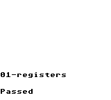             |              | 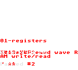             | 0 px        |
| 02-len_ctr               | ✅     | 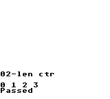               |                | 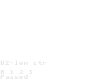               | 0 px        |
| 03-trigger               | ✅     | 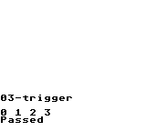               |                | 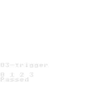               | 0 px        |
| 04-sweep                 | ✅     | 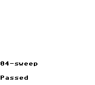                 |                  |                  | 0 px        |
| 05-sweep_details         | ✅     | 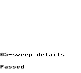         |          |          | 0 px        |
| 06-overflow_on_trigger   | ✅     | 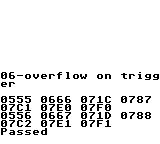   |    | 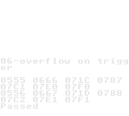   | 0 px        |
| 07-len_sweep_period_sync | ✅     | 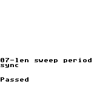 |  | 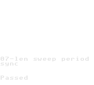 | 0 px        |
| 08-len_ctr_during_power  | ✅     | 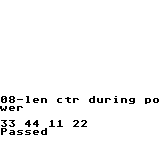  |   | 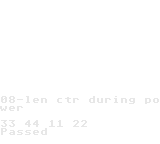  | 0 px        |
| 09-wave_read_while_on    | ❌     | 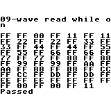    | 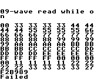    | 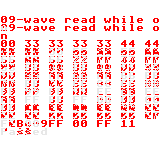    | 3433 px     |
| 10-wave_trigger_while_on | ❌     | 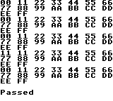 | 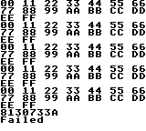 | 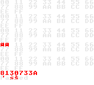 | 290 px      |
| 11-regs_after_power      | ✅     |       |       |       | 0 px        |
| 12-wave_write_while_on   | ❌     | 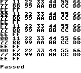   | 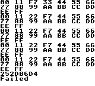   | 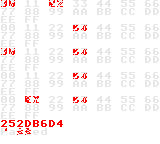   | 549 px      |

## Mooneye Test Suite

Source: https://github.com/Gekkio/mooneye-test-suite

Only DMG compatible tests.

**Passed 93/98 (94.9%)**

| Test                                                                         | Status |
| ---------------------------------------------------------------------------- | ------ |
| roms/mooneye-test-suite/build/acceptance/add_sp_e_timing.gb                  | ✅     |
| roms/mooneye-test-suite/build/acceptance/bits/mem_oam.gb                     | ✅     |
| roms/mooneye-test-suite/build/acceptance/bits/reg_f.gb                       | ✅     |
| roms/mooneye-test-suite/build/acceptance/bits/unused_hwio-GS.gb              | ✅     |
| roms/mooneye-test-suite/build/acceptance/boot_div-dmgABCmgb.gb               | ✅     |
| roms/mooneye-test-suite/build/acceptance/boot_hwio-dmgABCmgb.gb              | ✅     |
| roms/mooneye-test-suite/build/acceptance/boot_regs-dmgABC.gb                 | ✅     |
| roms/mooneye-test-suite/build/acceptance/call_cc_timing.gb                   | ✅     |
| roms/mooneye-test-suite/build/acceptance/call_cc_timing2.gb                  | ✅     |
| roms/mooneye-test-suite/build/acceptance/call_timing.gb                      | ✅     |
| roms/mooneye-test-suite/build/acceptance/call_timing2.gb                     | ✅     |
| roms/mooneye-test-suite/build/acceptance/di_timing-GS.gb                     | ✅     |
| roms/mooneye-test-suite/build/acceptance/div_timing.gb                       | ✅     |
| roms/mooneye-test-suite/build/acceptance/ei_sequence.gb                      | ✅     |
| roms/mooneye-test-suite/build/acceptance/ei_timing.gb                        | ✅     |
| roms/mooneye-test-suite/build/acceptance/halt_ime0_ei.gb                     | ✅     |
| roms/mooneye-test-suite/build/acceptance/halt_ime0_nointr_timing.gb          | ✅     |
| roms/mooneye-test-suite/build/acceptance/halt_ime1_timing.gb                 | ✅     |
| roms/mooneye-test-suite/build/acceptance/halt_ime1_timing2-GS.gb             | ✅     |
| roms/mooneye-test-suite/build/acceptance/if_ie_registers.gb                  | ✅     |
| roms/mooneye-test-suite/build/acceptance/instr/daa.gb                        | ✅     |
| roms/mooneye-test-suite/build/acceptance/interrupts/ie_push.gb               | ✅     |
| roms/mooneye-test-suite/build/acceptance/intr_timing.gb                      | ✅     |
| roms/mooneye-test-suite/build/acceptance/jp_cc_timing.gb                     | ✅     |
| roms/mooneye-test-suite/build/acceptance/jp_timing.gb                        | ✅     |
| roms/mooneye-test-suite/build/acceptance/ld_hl_sp_e_timing.gb                | ✅     |
| roms/mooneye-test-suite/build/acceptance/oam_dma/basic.gb                    | ✅     |
| roms/mooneye-test-suite/build/acceptance/oam_dma/reg_read.gb                 | ✅     |
| roms/mooneye-test-suite/build/acceptance/oam_dma/sources-GS.gb               | ✅     |
| roms/mooneye-test-suite/build/acceptance/oam_dma_restart.gb                  | ✅     |
| roms/mooneye-test-suite/build/acceptance/oam_dma_start.gb                    | ✅     |
| roms/mooneye-test-suite/build/acceptance/oam_dma_timing.gb                   | ✅     |
| roms/mooneye-test-suite/build/acceptance/pop_timing.gb                       | ✅     |
| roms/mooneye-test-suite/build/acceptance/ppu/hblank_ly_scx_timing-GS.gb      | ✅     |
| roms/mooneye-test-suite/build/acceptance/ppu/intr_1_2_timing-GS.gb           | ✅     |
| roms/mooneye-test-suite/build/acceptance/ppu/intr_2_0_timing.gb              | ✅     |
| roms/mooneye-test-suite/build/acceptance/ppu/intr_2_mode0_timing.gb          | ✅     |
| roms/mooneye-test-suite/build/acceptance/ppu/intr_2_mode0_timing_sprites.gb  | ✅     |
| roms/mooneye-test-suite/build/acceptance/ppu/intr_2_mode3_timing.gb          | ✅     |
| roms/mooneye-test-suite/build/acceptance/ppu/intr_2_oam_ok_timing.gb         | ✅     |
| roms/mooneye-test-suite/build/acceptance/ppu/lcdon_timing-GS.gb              | ✅     |
| roms/mooneye-test-suite/build/acceptance/ppu/lcdon_write_timing-GS.gb        | ✅     |
| roms/mooneye-test-suite/build/acceptance/ppu/stat_irq_blocking.gb            | ✅     |
| roms/mooneye-test-suite/build/acceptance/ppu/stat_lyc_onoff.gb               | ✅     |
| roms/mooneye-test-suite/build/acceptance/ppu/vblank_stat_intr-GS.gb          | ✅     |
| roms/mooneye-test-suite/build/acceptance/push_timing.gb                      | ✅     |
| roms/mooneye-test-suite/build/acceptance/rapid_di_ei.gb                      | ✅     |
| roms/mooneye-test-suite/build/acceptance/ret_cc_timing.gb                    | ✅     |
| roms/mooneye-test-suite/build/acceptance/ret_timing.gb                       | ✅     |
| roms/mooneye-test-suite/build/acceptance/reti_intr_timing.gb                 | ✅     |
| roms/mooneye-test-suite/build/acceptance/reti_timing.gb                      | ✅     |
| roms/mooneye-test-suite/build/acceptance/rst_timing.gb                       | ✅     |
| roms/mooneye-test-suite/build/acceptance/serial/boot_sclk_align-dmgABCmgb.gb | ❌     |
| roms/mooneye-test-suite/build/acceptance/timer/div_write.gb                  | ✅     |
| roms/mooneye-test-suite/build/acceptance/timer/rapid_toggle.gb               | ✅     |
| roms/mooneye-test-suite/build/acceptance/timer/tim00.gb                      | ✅     |
| roms/mooneye-test-suite/build/acceptance/timer/tim00_div_trigger.gb          | ✅     |
| roms/mooneye-test-suite/build/acceptance/timer/tim01.gb                      | ✅     |
| roms/mooneye-test-suite/build/acceptance/timer/tim01_div_trigger.gb          | ✅     |
| roms/mooneye-test-suite/build/acceptance/timer/tim10.gb                      | ✅     |
| roms/mooneye-test-suite/build/acceptance/timer/tim10_div_trigger.gb          | ✅     |
| roms/mooneye-test-suite/build/acceptance/timer/tim11.gb                      | ✅     |
| roms/mooneye-test-suite/build/acceptance/timer/tim11_div_trigger.gb          | ✅     |
| roms/mooneye-test-suite/build/acceptance/timer/tima_reload.gb                | ✅     |
| roms/mooneye-test-suite/build/acceptance/timer/tima_write_reloading.gb       | ✅     |
| roms/mooneye-test-suite/build/acceptance/timer/tma_write_reloading.gb        | ✅     |
| roms/mooneye-test-suite/build/emulator-only/mbc1/bits_bank1.gb               | ✅     |
| roms/mooneye-test-suite/build/emulator-only/mbc1/bits_bank2.gb               | ✅     |
| roms/mooneye-test-suite/build/emulator-only/mbc1/bits_mode.gb                | ✅     |
| roms/mooneye-test-suite/build/emulator-only/mbc1/bits_ramg.gb                | ✅     |
| roms/mooneye-test-suite/build/emulator-only/mbc1/multicart_rom_8Mb.gb        | ❌     |
| roms/mooneye-test-suite/build/emulator-only/mbc1/ram_256kb.gb                | ✅     |
| roms/mooneye-test-suite/build/emulator-only/mbc1/ram_64kb.gb                 | ✅     |
| roms/mooneye-test-suite/build/emulator-only/mbc1/rom_16Mb.gb                 | ✅     |
| roms/mooneye-test-suite/build/emulator-only/mbc1/rom_1Mb.gb                  | ✅     |
| roms/mooneye-test-suite/build/emulator-only/mbc1/rom_2Mb.gb                  | ✅     |
| roms/mooneye-test-suite/build/emulator-only/mbc1/rom_4Mb.gb                  | ✅     |
| roms/mooneye-test-suite/build/emulator-only/mbc1/rom_512kb.gb                | ✅     |
| roms/mooneye-test-suite/build/emulator-only/mbc1/rom_8Mb.gb                  | ✅     |
| roms/mooneye-test-suite/build/emulator-only/mbc2/bits_ramg.gb                | ✅     |
| roms/mooneye-test-suite/build/emulator-only/mbc2/bits_romb.gb                | ✅     |
| roms/mooneye-test-suite/build/emulator-only/mbc2/bits_unused.gb              | ✅     |
| roms/mooneye-test-suite/build/emulator-only/mbc2/ram.gb                      | ✅     |
| roms/mooneye-test-suite/build/emulator-only/mbc2/rom_1Mb.gb                  | ✅     |
| roms/mooneye-test-suite/build/emulator-only/mbc2/rom_2Mb.gb                  | ✅     |
| roms/mooneye-test-suite/build/emulator-only/mbc2/rom_512kb.gb                | ✅     |
| roms/mooneye-test-suite/build/emulator-only/mbc5/rom_16Mb.gb                 | ✅     |
| roms/mooneye-test-suite/build/emulator-only/mbc5/rom_1Mb.gb                  | ✅     |
| roms/mooneye-test-suite/build/emulator-only/mbc5/rom_2Mb.gb                  | ✅     |
| roms/mooneye-test-suite/build/emulator-only/mbc5/rom_32Mb.gb                 | ✅     |
| roms/mooneye-test-suite/build/emulator-only/mbc5/rom_4Mb.gb                  | ✅     |
| roms/mooneye-test-suite/build/emulator-only/mbc5/rom_512kb.gb                | ✅     |
| roms/mooneye-test-suite/build/emulator-only/mbc5/rom_64Mb.gb                 | ✅     |
| roms/mooneye-test-suite/build/emulator-only/mbc5/rom_8Mb.gb                  | ✅     |
| roms/mooneye-test-suite/build/madness/mgb_oam_dma_halt_sprites.gb            | ❌     |
| roms/mooneye-test-suite/build/manual-only/sprite_priority.gb                 | ❌     |
| roms/mooneye-test-suite/build/utils/bootrom_dumper.gb                        | ❌     |
| roms/mooneye-test-suite/build/utils/dump_boot_hwio.gb                        | ✅     |

## Wilbertpol's tests

Source: https://github.com/vojty/wilbertpol-test-suite

Only DMG compatible tests.

**Passed 39/39 (100.0%)**

| Test                                                                                     | Status |
| ---------------------------------------------------------------------------------------- | ------ |
| roms/wilbertpol-test-suite/build/acceptance/gpu/hblank_ly_scx_timing_nops.gb             | ✅     |
| roms/wilbertpol-test-suite/build/acceptance/gpu/hblank_ly_scx_timing_variant_nops.gb     | ✅     |
| roms/wilbertpol-test-suite/build/acceptance/gpu/intr_0_timing.gb                         | ✅     |
| roms/wilbertpol-test-suite/build/acceptance/gpu/intr_1_timing.gb                         | ✅     |
| roms/wilbertpol-test-suite/build/acceptance/gpu/intr_2_mode0_scx1_timing_nops.gb         | ✅     |
| roms/wilbertpol-test-suite/build/acceptance/gpu/intr_2_mode0_scx2_timing_nops.gb         | ✅     |
| roms/wilbertpol-test-suite/build/acceptance/gpu/intr_2_mode0_scx3_timing_nops.gb         | ✅     |
| roms/wilbertpol-test-suite/build/acceptance/gpu/intr_2_mode0_scx4_timing_nops.gb         | ✅     |
| roms/wilbertpol-test-suite/build/acceptance/gpu/intr_2_mode0_scx5_timing_nops.gb         | ✅     |
| roms/wilbertpol-test-suite/build/acceptance/gpu/intr_2_mode0_scx6_timing_nops.gb         | ✅     |
| roms/wilbertpol-test-suite/build/acceptance/gpu/intr_2_mode0_scx7_timing_nops.gb         | ✅     |
| roms/wilbertpol-test-suite/build/acceptance/gpu/intr_2_mode0_scx8_timing_nops.gb         | ✅     |
| roms/wilbertpol-test-suite/build/acceptance/gpu/intr_2_mode0_timing_sprites_nops.gb      | ✅     |
| roms/wilbertpol-test-suite/build/acceptance/gpu/intr_2_mode0_timing_sprites_scx1_nops.gb | ✅     |
| roms/wilbertpol-test-suite/build/acceptance/gpu/intr_2_mode0_timing_sprites_scx2_nops.gb | ✅     |
| roms/wilbertpol-test-suite/build/acceptance/gpu/intr_2_mode0_timing_sprites_scx3_nops.gb | ✅     |
| roms/wilbertpol-test-suite/build/acceptance/gpu/intr_2_mode0_timing_sprites_scx4_nops.gb | ✅     |
| roms/wilbertpol-test-suite/build/acceptance/gpu/intr_2_timing.gb                         | ✅     |
| roms/wilbertpol-test-suite/build/acceptance/gpu/lcdon_mode_timing.gb                     | ✅     |
| roms/wilbertpol-test-suite/build/acceptance/gpu/ly00_01_mode0_2.gb                       | ✅     |
| roms/wilbertpol-test-suite/build/acceptance/gpu/ly00_mode0_2-GS.gb                       | ✅     |
| roms/wilbertpol-test-suite/build/acceptance/gpu/ly00_mode1_0-GS.gb                       | ✅     |
| roms/wilbertpol-test-suite/build/acceptance/gpu/ly00_mode2_3.gb                          | ✅     |
| roms/wilbertpol-test-suite/build/acceptance/gpu/ly00_mode3_0.gb                          | ✅     |
| roms/wilbertpol-test-suite/build/acceptance/gpu/ly143_144_145.gb                         | ✅     |
| roms/wilbertpol-test-suite/build/acceptance/gpu/ly143_144_152_153.gb                     | ✅     |
| roms/wilbertpol-test-suite/build/acceptance/gpu/ly143_144_mode0_1.gb                     | ✅     |
| roms/wilbertpol-test-suite/build/acceptance/gpu/ly143_144_mode3_0.gb                     | ✅     |
| roms/wilbertpol-test-suite/build/acceptance/gpu/ly_lyc-GS.gb                             | ✅     |
| roms/wilbertpol-test-suite/build/acceptance/gpu/ly_lyc_0-GS.gb                           | ✅     |
| roms/wilbertpol-test-suite/build/acceptance/gpu/ly_lyc_0_write-GS.gb                     | ✅     |
| roms/wilbertpol-test-suite/build/acceptance/gpu/ly_lyc_144-GS.gb                         | ✅     |
| roms/wilbertpol-test-suite/build/acceptance/gpu/ly_lyc_153-GS.gb                         | ✅     |
| roms/wilbertpol-test-suite/build/acceptance/gpu/ly_lyc_153_write-GS.gb                   | ✅     |
| roms/wilbertpol-test-suite/build/acceptance/gpu/ly_lyc_write-GS.gb                       | ✅     |
| roms/wilbertpol-test-suite/build/acceptance/gpu/ly_new_frame-GS.gb                       | ✅     |
| roms/wilbertpol-test-suite/build/acceptance/gpu/stat_write_if-GS.gb                      | ✅     |
| roms/wilbertpol-test-suite/build/acceptance/gpu/vblank_if_timing.gb                      | ✅     |
| roms/wilbertpol-test-suite/build/acceptance/timer/timer_if.gb                            | ✅     |

## acid2 tests

Sources:

- https://github.com/mattcurrie/dmg-acid2
- https://github.com/mattcurrie/cgb-acid2

**Passed 2/2 (100.0%)**

| Test      | Status | Expected                    | Result                    | Diff                    | Diff pixels |
| --------- | ------ | --------------------------- | ------------------------- | ----------------------- | ----------- |
| dmg-acid2 | ✅     |  |  |  | 0 px        |
| cgb-acid2 | ✅     |  |  |  | 0 px        |

## Scribbltests

Source: https://github.com/Hacktix/scribbltests

**Passed 5/5 (100.0%)**

| Test      | Status | Expected                    | Result                    | Diff                    | Diff pixels |
| --------- | ------ | --------------------------- | ------------------------- | ----------------------- | ----------- |
| scxly     | ✅     |      |      |      | 0 px        |
| lycscx    | ✅     |     |     |     | 0 px        |
| lycscy    | ✅     |     |     |     | 0 px        |
| palettely | ✅     |  |  |  | 0 px        |
| statcount | ✅     | 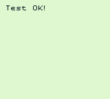 | 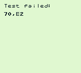 | 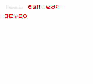 | 0 px        |

## TurtleTests

Source: https://github.com/Powerlated/TurtleTests

**Passed 2/2 (100.0%)**

| Test                          | Status | Expected                                        | Result                                        | Diff                                        | Diff pixels |
| ----------------------------- | ------ | ----------------------------------------------- | --------------------------------------------- | ------------------------------------------- | ----------- |
| window_y_trigger              | ✅     | 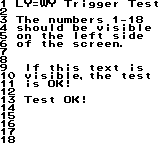              |               | 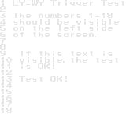              | 0 px        |
| window_y_trigger_wx_offscreen | ✅     | 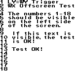 |  | 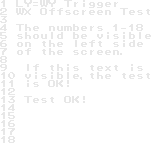 | 0 px        |

## MBC3-Tester

Source: https://github.com/EricKirschenmann/MBC3-Tester-gb

**Passed 1/1 (100.0%)**

| Test        | Status | Expected                      | Result                      | Diff                      | Diff pixels |
| ----------- | ------ | ----------------------------- | --------------------------- | ------------------------- | ----------- |
| MBC3-Tester | ✅     | 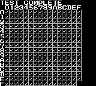 |  | 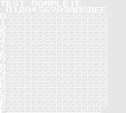 | 0 px        |

## Mealybug Tearoom Tests

Source: https://github.com/mattcurrie/mealybug-tearoom-tests

Only DMG tests with a reference image.

**Passed 18/24 (75.0%)**

| Test                              | Status | Expected                                            | Result                                            | Diff                                            | Diff pixels |
| --------------------------------- | ------ | --------------------------------------------------- | ------------------------------------------------- | ----------------------------------------------- | ----------- |
| m2_win_en_toggle                  | ✅     | 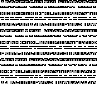                  | 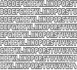                  |                   | 0 px        |
| m3_bgp_change                     | ✅     |                      |                      |                      | 0 px        |
| m3_bgp_change_sprites             | ✅     |              |              |              | 0 px        |
| m3_lcdc_bg_en_change              | ❌     | 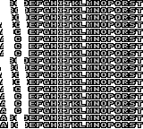              | 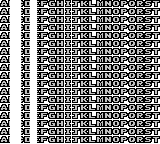              | 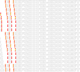              | 286 px      |
| m3_lcdc_bg_map_change             | ✅     |              |              |              | 0 px        |
| m3_lcdc_obj_en_change             | ❌     |              |              |              | 256 px      |
| m3_lcdc_obj_en_change_variant     | ❌     |      |      |      | 256 px      |
| m3_lcdc_obj_size_change           | ❌     | 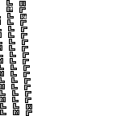           | 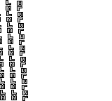           |            | 309 px      |
| m3_lcdc_obj_size_change_scx       | ❌     |        |        |        | 190 px      |
| m3_lcdc_tile_sel_change           | ✅     |            |            |            | 0 px        |
| m3_lcdc_tile_sel_win_change       | ✅     |        |        |        | 0 px        |
| m3_lcdc_win_en_change_multiple    | ✅     | 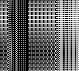    | 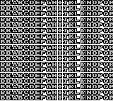    |     | 0 px        |
| m3_lcdc_win_en_change_multiple_wx | ✅     |  |  |  | 0 px        |
| m3_lcdc_win_map_change            | ✅     |             |             |             | 0 px        |
| m3_obp0_change                    | ❌     |                     |                     |                     | 124 px      |
| m3_scx_high_5_bits                | ✅     | 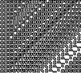                | 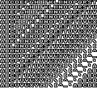                |                 | 0 px        |
| m3_scx_low_3_bits                 | ✅     |                  |                  |                  | 0 px        |
| m3_scy_change                     | ✅     |                      |                      |                      | 0 px        |
| m3_window_timing                  | ✅     |                   |                   |                   | 0 px        |
| m3_window_timing_wx_0             | ✅     |              |              |              | 0 px        |
| m3_wx_4_change                    | ✅     | 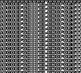                    | 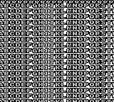                    |                     | 0 px        |
| m3_wx_4_change_sprites            | ✅     |             |             |             | 0 px        |
| m3_wx_5_change                    | ✅     |                     | 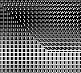                    | 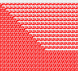                    | 0 px        |
| m3_wx_6_change                    | ✅     | 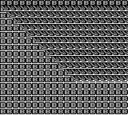                    | 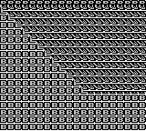                    | 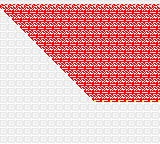                    | 0 px        |

## AGE test suite

Source: https://github.com/c-sp/age-test-roms

Only DMG tests for now.

**Passed 8/11 (72.7%)**

| Test                                                                        | Status | Screenshot                                                 |
| --------------------------------------------------------------------------- | ------ | ---------------------------------------------------------- |
| roms/age-test-roms/build/halt/ei-halt-dmgC-cgbBCE.gb                        | ❌     | 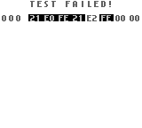           |
| roms/age-test-roms/build/halt/halt-m0-interrupt-dmgC-cgbBCE.gb              | ❌     | 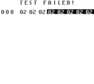 |
| roms/age-test-roms/build/halt/halt-prefetch-dmgC-cgbBCE.gb                  | ✅     | 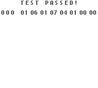     |
| roms/age-test-roms/build/ly/ly-dmgC-cgbBC.gb                                | ✅     | 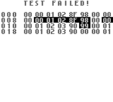                 |
| roms/age-test-roms/build/oam/oam-read-dmgC-cgbBC.gb                         | ✅     | 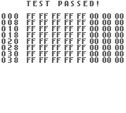           |
| roms/age-test-roms/build/oam/oam-write-dmgC.gb                              | ❌     | 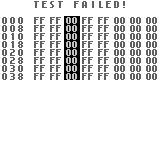                |
| roms/age-test-roms/build/stat-interrupt/stat-int-dmgC-cgbBCE.gb             | ✅     | 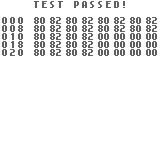          |
| roms/age-test-roms/build/stat-mode/stat-mode-dmgC-cgbBC.gb                  | ✅     | 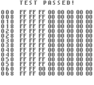          |
| roms/age-test-roms/build/stat-mode-sprites/stat-mode-sprites-dmgC-cgbBCE.gb | ✅     | 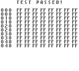 |
| roms/age-test-roms/build/stat-mode-window/stat-mode-window-dmgC.gb          | ✅     | 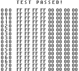         |
| roms/age-test-roms/build/vram/vram-read-dmgC.gb                             | ✅     |                 |

## gbmicrotest

Source: https://github.com/aappleby/gbmicrotest

Hardware verified DMG tests.

**Passed 406/482 (84.2%)**

| Test                                                  | Status | Details             |
| ----------------------------------------------------- | ------ | ------------------- |
| roms/gbmicrotest/bin/div_inc_timing_a.gb              | ✅     | got 00, expected 00 |
| roms/gbmicrotest/bin/div_inc_timing_b.gb              | ✅     | got 01, expected 01 |
| roms/gbmicrotest/bin/dma_0x1000.gb                    | ✅     | got 99, expected 99 |
| roms/gbmicrotest/bin/dma_0x9000.gb                    | ✅     | got 99, expected 99 |
| roms/gbmicrotest/bin/dma_0xA000.gb                    | ✅     | got 99, expected 99 |
| roms/gbmicrotest/bin/dma_0xC000.gb                    | ✅     | got 99, expected 99 |
| roms/gbmicrotest/bin/dma_0xE000.gb                    | ✅     | got 99, expected 99 |
| roms/gbmicrotest/bin/dma_timing_a.gb                  | ✅     | got 81, expected 81 |
| roms/gbmicrotest/bin/halt_bug.gb                      | ✅     | got 14, expected 14 |
| roms/gbmicrotest/bin/halt_op_dupe.gb                  | ✅     | got 02, expected 02 |
| roms/gbmicrotest/bin/halt_op_dupe_delay.gb            | ❌     | got 01, expected 55 |
| roms/gbmicrotest/bin/hblank_int_di_timing_a.gb        | ✅     | got 02, expected 01 |
| roms/gbmicrotest/bin/hblank_int_di_timing_b.gb        | ✅     | got 02, expected 01 |
| roms/gbmicrotest/bin/hblank_int_if_a.gb               | ✅     | got e0, expected e0 |
| roms/gbmicrotest/bin/hblank_int_if_b.gb               | ✅     | got e2, expected e2 |
| roms/gbmicrotest/bin/hblank_int_l0.gb                 | ✅     | got 3d, expected 3d |
| roms/gbmicrotest/bin/hblank_int_l1.gb                 | ✅     | got 32, expected 32 |
| roms/gbmicrotest/bin/hblank_int_l2.gb                 | ✅     | got 32, expected 32 |
| roms/gbmicrotest/bin/hblank_int_scx0.gb               | ✅     | got 2d, expected 2d |
| roms/gbmicrotest/bin/hblank_int_scx0_if_a.gb          | ❌     | got 00, expected ff |
| roms/gbmicrotest/bin/hblank_int_scx0_if_b.gb          | ❌     | got 00, expected e0 |
| roms/gbmicrotest/bin/hblank_int_scx0_if_c.gb          | ❌     | got 00, expected e2 |
| roms/gbmicrotest/bin/hblank_int_scx0_if_d.gb          | ✅     | got 00, expected 00 |
| roms/gbmicrotest/bin/hblank_int_scx1.gb               | ✅     | got 2d, expected 2d |
| roms/gbmicrotest/bin/hblank_int_scx1_if_a.gb          | ❌     | got 00, expected ff |
| roms/gbmicrotest/bin/hblank_int_scx1_if_b.gb          | ❌     | got 00, expected e0 |
| roms/gbmicrotest/bin/hblank_int_scx1_if_c.gb          | ❌     | got 00, expected e2 |
| roms/gbmicrotest/bin/hblank_int_scx1_if_d.gb          | ✅     | got 00, expected 00 |
| roms/gbmicrotest/bin/hblank_int_scx1_nops_a.gb        | ✅     | got 00, expected 00 |
| roms/gbmicrotest/bin/hblank_int_scx1_nops_b.gb        | ❌     | got 00, expected 01 |
| roms/gbmicrotest/bin/hblank_int_scx2.gb               | ✅     | got 2d, expected 2d |
| roms/gbmicrotest/bin/hblank_int_scx2_if_a.gb          | ❌     | got 00, expected ff |
| roms/gbmicrotest/bin/hblank_int_scx2_if_b.gb          | ❌     | got 00, expected e0 |
| roms/gbmicrotest/bin/hblank_int_scx2_if_c.gb          | ❌     | got 00, expected e2 |
| roms/gbmicrotest/bin/hblank_int_scx2_if_d.gb          | ✅     | got 00, expected 00 |
| roms/gbmicrotest/bin/hblank_int_scx2_nops_a.gb        | ✅     | got 00, expected 00 |
| roms/gbmicrotest/bin/hblank_int_scx2_nops_b.gb        | ❌     | got 00, expected 01 |
| roms/gbmicrotest/bin/hblank_int_scx3.gb               | ✅     | got 00, expected 01 |
| roms/gbmicrotest/bin/hblank_int_scx3_if_a.gb          | ❌     | got 00, expected ff |
| roms/gbmicrotest/bin/hblank_int_scx3_if_b.gb          | ❌     | got 00, expected e0 |
| roms/gbmicrotest/bin/hblank_int_scx3_if_c.gb          | ❌     | got 00, expected e2 |
| roms/gbmicrotest/bin/hblank_int_scx3_if_d.gb          | ✅     | got 00, expected 00 |
| roms/gbmicrotest/bin/hblank_int_scx3_nops_a.gb        | ✅     | got 00, expected 00 |
| roms/gbmicrotest/bin/hblank_int_scx3_nops_b.gb        | ❌     | got 00, expected 01 |
| roms/gbmicrotest/bin/hblank_int_scx4.gb               | ✅     | got 2e, expected 2e |
| roms/gbmicrotest/bin/hblank_int_scx4_if_a.gb          | ❌     | got 00, expected ff |
| roms/gbmicrotest/bin/hblank_int_scx4_if_b.gb          | ❌     | got 00, expected e0 |
| roms/gbmicrotest/bin/hblank_int_scx4_if_c.gb          | ❌     | got 00, expected e2 |
| roms/gbmicrotest/bin/hblank_int_scx4_if_d.gb          | ✅     | got 00, expected 00 |
| roms/gbmicrotest/bin/hblank_int_scx4_nops_a.gb        | ✅     | got 00, expected 00 |
| roms/gbmicrotest/bin/hblank_int_scx4_nops_b.gb        | ❌     | got 00, expected 01 |
| roms/gbmicrotest/bin/hblank_int_scx5.gb               | ✅     | got 2e, expected 2e |
| roms/gbmicrotest/bin/hblank_int_scx5_if_a.gb          | ❌     | got 00, expected ff |
| roms/gbmicrotest/bin/hblank_int_scx5_if_b.gb          | ❌     | got 00, expected e0 |
| roms/gbmicrotest/bin/hblank_int_scx5_if_c.gb          | ❌     | got 00, expected e2 |
| roms/gbmicrotest/bin/hblank_int_scx5_if_d.gb          | ✅     | got 00, expected 00 |
| roms/gbmicrotest/bin/hblank_int_scx5_nops_a.gb        | ✅     | got 00, expected 00 |
| roms/gbmicrotest/bin/hblank_int_scx5_nops_b.gb        | ❌     | got 00, expected 01 |
| roms/gbmicrotest/bin/hblank_int_scx6.gb               | ✅     | got 2e, expected 2e |
| roms/gbmicrotest/bin/hblank_int_scx6_if_a.gb          | ❌     | got 00, expected ff |
| roms/gbmicrotest/bin/hblank_int_scx6_if_b.gb          | ❌     | got 00, expected e0 |
| roms/gbmicrotest/bin/hblank_int_scx6_if_c.gb          | ❌     | got 00, expected e2 |
| roms/gbmicrotest/bin/hblank_int_scx6_if_d.gb          | ✅     | got 00, expected 00 |
| roms/gbmicrotest/bin/hblank_int_scx6_nops_a.gb        | ✅     | got 00, expected 00 |
| roms/gbmicrotest/bin/hblank_int_scx6_nops_b.gb        | ❌     | got 00, expected 01 |
| roms/gbmicrotest/bin/hblank_int_scx7.gb               | ✅     | got 2f, expected 2f |
| roms/gbmicrotest/bin/hblank_int_scx7_if_a.gb          | ❌     | got 00, expected ff |
| roms/gbmicrotest/bin/hblank_int_scx7_if_b.gb          | ❌     | got 00, expected e0 |
| roms/gbmicrotest/bin/hblank_int_scx7_if_c.gb          | ❌     | got 00, expected e2 |
| roms/gbmicrotest/bin/hblank_int_scx7_if_d.gb          | ✅     | got 00, expected 00 |
| roms/gbmicrotest/bin/hblank_int_scx7_nops_a.gb        | ✅     | got 00, expected 00 |
| roms/gbmicrotest/bin/hblank_int_scx7_nops_b.gb        | ❌     | got 00, expected 01 |
| roms/gbmicrotest/bin/hblank_scx2_if_a.gb              | ✅     | got e2, expected e2 |
| roms/gbmicrotest/bin/hblank_scx3_if_a.gb              | ✅     | got e0, expected 01 |
| roms/gbmicrotest/bin/hblank_scx3_if_b.gb              | ✅     | got e0, expected e0 |
| roms/gbmicrotest/bin/hblank_scx3_if_c.gb              | ✅     | got e2, expected e2 |
| roms/gbmicrotest/bin/hblank_scx3_if_d.gb              | ✅     | got 00, expected 00 |
| roms/gbmicrotest/bin/hblank_scx3_int_a.gb             | ✅     | got 00, expected 01 |
| roms/gbmicrotest/bin/hblank_scx3_int_b.gb             | ✅     | got 00, expected 01 |
| roms/gbmicrotest/bin/int_hblank_halt_bug_a.gb         | ✅     | got 01, expected 01 |
| roms/gbmicrotest/bin/int_hblank_halt_bug_b.gb         | ✅     | got 02, expected 02 |
| roms/gbmicrotest/bin/int_hblank_halt_scx0.gb          | ✅     | got 62, expected 62 |
| roms/gbmicrotest/bin/int_hblank_halt_scx1.gb          | ✅     | got 62, expected 62 |
| roms/gbmicrotest/bin/int_hblank_halt_scx2.gb          | ✅     | got 62, expected 62 |
| roms/gbmicrotest/bin/int_hblank_halt_scx3.gb          | ✅     | got 63, expected 63 |
| roms/gbmicrotest/bin/int_hblank_halt_scx4.gb          | ✅     | got 63, expected 63 |
| roms/gbmicrotest/bin/int_hblank_halt_scx5.gb          | ✅     | got 63, expected 63 |
| roms/gbmicrotest/bin/int_hblank_halt_scx6.gb          | ✅     | got 63, expected 63 |
| roms/gbmicrotest/bin/int_hblank_halt_scx7.gb          | ✅     | got 64, expected 64 |
| roms/gbmicrotest/bin/int_hblank_incs_scx0.gb          | ✅     | got 3d, expected 3d |
| roms/gbmicrotest/bin/int_hblank_incs_scx1.gb          | ✅     | got 3e, expected 3e |
| roms/gbmicrotest/bin/int_hblank_incs_scx2.gb          | ✅     | got 3e, expected 3e |
| roms/gbmicrotest/bin/int_hblank_incs_scx3.gb          | ✅     | got 3e, expected 3e |
| roms/gbmicrotest/bin/int_hblank_incs_scx4.gb          | ✅     | got 3e, expected 3e |
| roms/gbmicrotest/bin/int_hblank_incs_scx5.gb          | ✅     | got 3f, expected 3f |
| roms/gbmicrotest/bin/int_hblank_incs_scx6.gb          | ✅     | got 3f, expected 3f |
| roms/gbmicrotest/bin/int_hblank_incs_scx7.gb          | ✅     | got 3f, expected 3f |
| roms/gbmicrotest/bin/int_hblank_nops_scx0.gb          | ✅     | got 61, expected 61 |
| roms/gbmicrotest/bin/int_hblank_nops_scx1.gb          | ✅     | got 62, expected 62 |
| roms/gbmicrotest/bin/int_hblank_nops_scx2.gb          | ✅     | got 62, expected 62 |
| roms/gbmicrotest/bin/int_hblank_nops_scx3.gb          | ✅     | got 62, expected 62 |
| roms/gbmicrotest/bin/int_hblank_nops_scx4.gb          | ✅     | got 62, expected 62 |
| roms/gbmicrotest/bin/int_hblank_nops_scx5.gb          | ✅     | got 63, expected 63 |
| roms/gbmicrotest/bin/int_hblank_nops_scx6.gb          | ✅     | got 63, expected 63 |
| roms/gbmicrotest/bin/int_hblank_nops_scx7.gb          | ✅     | got 63, expected 63 |
| roms/gbmicrotest/bin/int_lyc_halt.gb                  | ✅     | got 99, expected 99 |
| roms/gbmicrotest/bin/int_lyc_incs.gb                  | ✅     | got 70, expected 70 |
| roms/gbmicrotest/bin/int_lyc_nops.gb                  | ✅     | got 99, expected 99 |
| roms/gbmicrotest/bin/int_oam_halt.gb                  | ✅     | got 94, expected 94 |
| roms/gbmicrotest/bin/int_oam_incs.gb                  | ✅     | got 6f, expected 6f |
| roms/gbmicrotest/bin/int_oam_nops.gb                  | ✅     | got 93, expected 93 |
| roms/gbmicrotest/bin/int_timer_halt.gb                | ✅     | got 0f, expected 0f |
| roms/gbmicrotest/bin/int_timer_halt_div_a.gb          | ✅     | got 02, expected 02 |
| roms/gbmicrotest/bin/int_timer_halt_div_b.gb          | ✅     | got 03, expected 03 |
| roms/gbmicrotest/bin/int_timer_incs.gb                | ✅     | got 09, expected 09 |
| roms/gbmicrotest/bin/int_timer_nops.gb                | ✅     | got 0e, expected 0e |
| roms/gbmicrotest/bin/int_timer_nops_div_a.gb          | ✅     | got 02, expected 02 |
| roms/gbmicrotest/bin/int_timer_nops_div_b.gb          | ✅     | got 03, expected 03 |
| roms/gbmicrotest/bin/int_vblank1_halt.gb              | ✅     | got 42, expected 42 |
| roms/gbmicrotest/bin/int_vblank1_incs.gb              | ✅     | got 0e, expected 0e |
| roms/gbmicrotest/bin/int_vblank1_nops.gb              | ✅     | got 42, expected 42 |
| roms/gbmicrotest/bin/int_vblank2_halt.gb              | ✅     | got 45, expected 45 |
| roms/gbmicrotest/bin/int_vblank2_incs.gb              | ✅     | got 0e, expected 0e |
| roms/gbmicrotest/bin/int_vblank2_nops.gb              | ✅     | got 45, expected 45 |
| roms/gbmicrotest/bin/is_if_set_during_ime0.gb         | ✅     | got e3, expected e3 |
| roms/gbmicrotest/bin/lcdon_halt_to_vblank_int_a.gb    | ✅     | got 00, expected 00 |
| roms/gbmicrotest/bin/lcdon_halt_to_vblank_int_b.gb    | ✅     | got 01, expected 01 |
| roms/gbmicrotest/bin/lcdon_nops_to_vblank_int_a.gb    | ✅     | got 00, expected 00 |
| roms/gbmicrotest/bin/lcdon_nops_to_vblank_int_b.gb    | ✅     | got 01, expected 01 |
| roms/gbmicrotest/bin/lcdon_to_if_oam_a.gb             | ✅     | got e0, expected e0 |
| roms/gbmicrotest/bin/lcdon_to_if_oam_b.gb             | ✅     | got e2, expected e2 |
| roms/gbmicrotest/bin/lcdon_to_ly1_a.gb                | ✅     | got 00, expected 00 |
| roms/gbmicrotest/bin/lcdon_to_ly1_b.gb                | ✅     | got 01, expected 01 |
| roms/gbmicrotest/bin/lcdon_to_ly2_a.gb                | ✅     | got 01, expected 01 |
| roms/gbmicrotest/bin/lcdon_to_ly2_b.gb                | ✅     | got 02, expected 02 |
| roms/gbmicrotest/bin/lcdon_to_ly3_a.gb                | ✅     | got 02, expected 02 |
| roms/gbmicrotest/bin/lcdon_to_ly3_b.gb                | ✅     | got 03, expected 03 |
| roms/gbmicrotest/bin/lcdon_to_lyc1_int.gb             | ✅     | got 70, expected 70 |
| roms/gbmicrotest/bin/lcdon_to_lyc2_int.gb             | ✅     | got e2, expected e2 |
| roms/gbmicrotest/bin/lcdon_to_lyc3_int.gb             | ✅     | got 54, expected 54 |
| roms/gbmicrotest/bin/lcdon_to_oam_int_l0.gb           | ✅     | got 6f, expected 6f |
| roms/gbmicrotest/bin/lcdon_to_oam_int_l1.gb           | ✅     | got 64, expected 64 |
| roms/gbmicrotest/bin/lcdon_to_oam_int_l2.gb           | ✅     | got 64, expected 64 |
| roms/gbmicrotest/bin/lcdon_to_oam_unlock_a.gb         | ✅     | got 27, expected 27 |
| roms/gbmicrotest/bin/lcdon_to_oam_unlock_b.gb         | ✅     | got ff, expected ff |
| roms/gbmicrotest/bin/lcdon_to_oam_unlock_c.gb         | ✅     | got ff, expected ff |
| roms/gbmicrotest/bin/lcdon_to_oam_unlock_d.gb         | ✅     | got 27, expected 27 |
| roms/gbmicrotest/bin/lcdon_to_stat0_a.gb              | ✅     | got 87, expected 87 |
| roms/gbmicrotest/bin/lcdon_to_stat0_b.gb              | ✅     | got 84, expected 84 |
| roms/gbmicrotest/bin/lcdon_to_stat0_c.gb              | ✅     | got 83, expected 83 |
| roms/gbmicrotest/bin/lcdon_to_stat0_d.gb              | ✅     | got 80, expected 80 |
| roms/gbmicrotest/bin/lcdon_to_stat1_a.gb              | ✅     | got 80, expected 80 |
| roms/gbmicrotest/bin/lcdon_to_stat1_b.gb              | ✅     | got 81, expected 81 |
| roms/gbmicrotest/bin/lcdon_to_stat1_c.gb              | ✅     | got 85, expected 85 |
| roms/gbmicrotest/bin/lcdon_to_stat1_d.gb              | ✅     | got 84, expected 84 |
| roms/gbmicrotest/bin/lcdon_to_stat1_e.gb              | ✅     | got 86, expected 86 |
| roms/gbmicrotest/bin/lcdon_to_stat2_a.gb              | ✅     | got 80, expected 80 |
| roms/gbmicrotest/bin/lcdon_to_stat2_b.gb              | ✅     | got 82, expected 82 |
| roms/gbmicrotest/bin/lcdon_to_stat2_c.gb              | ✅     | got 80, expected 80 |
| roms/gbmicrotest/bin/lcdon_to_stat2_d.gb              | ✅     | got 82, expected 82 |
| roms/gbmicrotest/bin/lcdon_to_stat3_a.gb              | ✅     | got 84, expected 84 |
| roms/gbmicrotest/bin/lcdon_to_stat3_b.gb              | ✅     | got 87, expected 87 |
| roms/gbmicrotest/bin/lcdon_to_stat3_c.gb              | ✅     | got 82, expected 82 |
| roms/gbmicrotest/bin/lcdon_to_stat3_d.gb              | ✅     | got 83, expected 83 |
| roms/gbmicrotest/bin/line_144_oam_int_a.gb            | ✅     | got e0, expected e0 |
| roms/gbmicrotest/bin/line_144_oam_int_b.gb            | ✅     | got e0, expected e0 |
| roms/gbmicrotest/bin/line_144_oam_int_c.gb            | ✅     | got e2, expected e2 |
| roms/gbmicrotest/bin/line_144_oam_int_d.gb            | ✅     | got 00, expected 00 |
| roms/gbmicrotest/bin/line_153_ly_a.gb                 | ✅     | got 98, expected 98 |
| roms/gbmicrotest/bin/line_153_ly_b.gb                 | ✅     | got 99, expected 99 |
| roms/gbmicrotest/bin/line_153_ly_c.gb                 | ✅     | got 00, expected 00 |
| roms/gbmicrotest/bin/line_153_ly_d.gb                 | ✅     | got 00, expected 00 |
| roms/gbmicrotest/bin/line_153_ly_e.gb                 | ✅     | got 00, expected 00 |
| roms/gbmicrotest/bin/line_153_ly_f.gb                 | ✅     | got 01, expected 01 |
| roms/gbmicrotest/bin/line_153_lyc0_int_inc_sled.gb    | ✅     | got 62, expected 62 |
| roms/gbmicrotest/bin/line_153_lyc0_stat_timing_a.gb   | ✅     | got c1, expected c1 |
| roms/gbmicrotest/bin/line_153_lyc0_stat_timing_b.gb   | ✅     | got c1, expected c1 |
| roms/gbmicrotest/bin/line_153_lyc0_stat_timing_c.gb   | ✅     | got c1, expected c1 |
| roms/gbmicrotest/bin/line_153_lyc0_stat_timing_d.gb   | ✅     | got c5, expected c5 |
| roms/gbmicrotest/bin/line_153_lyc0_stat_timing_e.gb   | ✅     | got c5, expected c5 |
| roms/gbmicrotest/bin/line_153_lyc0_stat_timing_f.gb   | ✅     | got c4, expected c4 |
| roms/gbmicrotest/bin/line_153_lyc0_stat_timing_g.gb   | ✅     | got c6, expected c6 |
| roms/gbmicrotest/bin/line_153_lyc0_stat_timing_h.gb   | ✅     | got c6, expected c6 |
| roms/gbmicrotest/bin/line_153_lyc0_stat_timing_i.gb   | ✅     | got c7, expected c7 |
| roms/gbmicrotest/bin/line_153_lyc0_stat_timing_j.gb   | ✅     | got c7, expected c7 |
| roms/gbmicrotest/bin/line_153_lyc0_stat_timing_k.gb   | ✅     | got c4, expected c4 |
| roms/gbmicrotest/bin/line_153_lyc0_stat_timing_l.gb   | ✅     | got c4, expected c4 |
| roms/gbmicrotest/bin/line_153_lyc0_stat_timing_m.gb   | ✅     | got c0, expected c0 |
| roms/gbmicrotest/bin/line_153_lyc0_stat_timing_n.gb   | ✅     | got c2, expected c2 |
| roms/gbmicrotest/bin/line_153_lyc153_stat_timing_a.gb | ✅     | got c1, expected c1 |
| roms/gbmicrotest/bin/line_153_lyc153_stat_timing_b.gb | ✅     | got c5, expected c5 |
| roms/gbmicrotest/bin/line_153_lyc153_stat_timing_c.gb | ✅     | got c1, expected c1 |
| roms/gbmicrotest/bin/line_153_lyc153_stat_timing_d.gb | ✅     | got c1, expected c1 |
| roms/gbmicrotest/bin/line_153_lyc153_stat_timing_e.gb | ✅     | got c0, expected c0 |
| roms/gbmicrotest/bin/line_153_lyc153_stat_timing_f.gb | ✅     | got c2, expected c2 |
| roms/gbmicrotest/bin/line_153_lyc_a.gb                | ✅     | got 81, expected 81 |
| roms/gbmicrotest/bin/line_153_lyc_b.gb                | ❌     | got 81, expected 85 |
| roms/gbmicrotest/bin/line_153_lyc_c.gb                | ✅     | got 81, expected 81 |
| roms/gbmicrotest/bin/line_153_lyc_int_a.gb            | ✅     | got 99, expected 01 |
| roms/gbmicrotest/bin/line_153_lyc_int_b.gb            | ✅     | got ff, expected 01 |
| roms/gbmicrotest/bin/line_65_ly.gb                    | ❌     | got 41, expected 40 |
| roms/gbmicrotest/bin/lyc1_int_halt_a.gb               | ✅     | got 01, expected 01 |
| roms/gbmicrotest/bin/lyc1_int_halt_b.gb               | ✅     | got 02, expected 02 |
| roms/gbmicrotest/bin/lyc1_int_if_edge_a.gb            | ✅     | got e0, expected e0 |
| roms/gbmicrotest/bin/lyc1_int_if_edge_b.gb            | ✅     | got e2, expected e2 |
| roms/gbmicrotest/bin/lyc1_int_if_edge_c.gb            | ❌     | got e0, expected e2 |
| roms/gbmicrotest/bin/lyc1_int_if_edge_d.gb            | ✅     | got e0, expected e0 |
| roms/gbmicrotest/bin/lyc1_int_nops_a.gb               | ✅     | got 01, expected 01 |
| roms/gbmicrotest/bin/lyc1_int_nops_b.gb               | ✅     | got 02, expected 02 |
| roms/gbmicrotest/bin/lyc1_write_timing_a.gb           | ✅     | got 01, expected 01 |
| roms/gbmicrotest/bin/lyc1_write_timing_b.gb           | ✅     | got 01, expected 01 |
| roms/gbmicrotest/bin/lyc1_write_timing_c.gb           | ✅     | got 01, expected 01 |
| roms/gbmicrotest/bin/lyc1_write_timing_d.gb           | ✅     | got 01, expected 01 |
| roms/gbmicrotest/bin/lyc2_int_halt_a.gb               | ✅     | got 01, expected 01 |
| roms/gbmicrotest/bin/lyc2_int_halt_b.gb               | ✅     | got 02, expected 02 |
| roms/gbmicrotest/bin/lyc_int_halt_a.gb                | ✅     | got 04, expected 04 |
| roms/gbmicrotest/bin/lyc_int_halt_b.gb                | ✅     | got 05, expected 05 |
| roms/gbmicrotest/bin/mbc1_ram_banks.gb                | ✅     | got 01, expected 01 |
| roms/gbmicrotest/bin/mbc1_rom_banks.gb                | ❌     | got ff, expected ff |
| roms/gbmicrotest/bin/oam_int_halt_a.gb                | ✅     | got 01, expected 01 |
| roms/gbmicrotest/bin/oam_int_halt_b.gb                | ✅     | got 02, expected 02 |
| roms/gbmicrotest/bin/oam_int_if_edge_a.gb             | ✅     | got e0, expected e0 |
| roms/gbmicrotest/bin/oam_int_if_edge_b.gb             | ✅     | got e2, expected e2 |
| roms/gbmicrotest/bin/oam_int_if_edge_c.gb             | ✅     | got e2, expected e2 |
| roms/gbmicrotest/bin/oam_int_if_edge_d.gb             | ✅     | got e0, expected e0 |
| roms/gbmicrotest/bin/oam_int_if_level_c.gb            | ✅     | got e2, expected e2 |
| roms/gbmicrotest/bin/oam_int_if_level_d.gb            | ✅     | got e0, expected e0 |
| roms/gbmicrotest/bin/oam_int_inc_sled.gb              | ✅     | got 64, expected 64 |
| roms/gbmicrotest/bin/oam_int_nops_a.gb                | ✅     | got 01, expected 01 |
| roms/gbmicrotest/bin/oam_int_nops_b.gb                | ✅     | got 02, expected 02 |
| roms/gbmicrotest/bin/oam_read_l0_a.gb                 | ✅     | got f0, expected f0 |
| roms/gbmicrotest/bin/oam_read_l0_b.gb                 | ✅     | got ff, expected ff |
| roms/gbmicrotest/bin/oam_read_l0_c.gb                 | ✅     | got ff, expected ff |
| roms/gbmicrotest/bin/oam_read_l0_d.gb                 | ✅     | got f0, expected f0 |
| roms/gbmicrotest/bin/oam_read_l1_a.gb                 | ✅     | got ff, expected ff |
| roms/gbmicrotest/bin/oam_read_l1_b.gb                 | ✅     | got ff, expected ff |
| roms/gbmicrotest/bin/oam_read_l1_c.gb                 | ✅     | got ff, expected ff |
| roms/gbmicrotest/bin/oam_read_l1_d.gb                 | ✅     | got f0, expected f0 |
| roms/gbmicrotest/bin/oam_read_l1_e.gb                 | ✅     | got f0, expected f0 |
| roms/gbmicrotest/bin/oam_read_l1_f.gb                 | ✅     | got ff, expected ff |
| roms/gbmicrotest/bin/oam_write_l0_a.gb                | ✅     | got 91, expected 91 |
| roms/gbmicrotest/bin/oam_write_l0_b.gb                | ✅     | got f0, expected f0 |
| roms/gbmicrotest/bin/oam_write_l0_c.gb                | ✅     | got f0, expected f0 |
| roms/gbmicrotest/bin/oam_write_l0_d.gb                | ✅     | got 91, expected 91 |
| roms/gbmicrotest/bin/oam_write_l0_e.gb                | ✅     | got 91, expected 91 |
| roms/gbmicrotest/bin/oam_write_l1_a.gb                | ✅     | got f0, expected f0 |
| roms/gbmicrotest/bin/oam_write_l1_b.gb                | ✅     | got f0, expected f0 |
| roms/gbmicrotest/bin/oam_write_l1_c.gb                | ✅     | got 91, expected 91 |
| roms/gbmicrotest/bin/oam_write_l1_d.gb                | ✅     | got f0, expected f0 |
| roms/gbmicrotest/bin/oam_write_l1_e.gb                | ✅     | got f0, expected f0 |
| roms/gbmicrotest/bin/oam_write_l1_f.gb                | ✅     | got 91, expected 91 |
| roms/gbmicrotest/bin/poweron_bgp_000.gb               | ✅     | got fc, expected fc |
| roms/gbmicrotest/bin/poweron_div_000.gb               | ✅     | got ab, expected ab |
| roms/gbmicrotest/bin/poweron_div_004.gb               | ✅     | got ab, expected ab |
| roms/gbmicrotest/bin/poweron_div_005.gb               | ✅     | got ac, expected ac |
| roms/gbmicrotest/bin/poweron_dma_000.gb               | ✅     | got ff, expected ff |
| roms/gbmicrotest/bin/poweron_if_000.gb                | ✅     | got e1, expected e1 |
| roms/gbmicrotest/bin/poweron_joy_000.gb               | ✅     | got cf, expected cf |
| roms/gbmicrotest/bin/poweron_lcdc_000.gb              | ✅     | got 91, expected 91 |
| roms/gbmicrotest/bin/poweron_ly_000.gb                | ✅     | got 00, expected 00 |
| roms/gbmicrotest/bin/poweron_ly_119.gb                | ❌     | got 01, expected 00 |
| roms/gbmicrotest/bin/poweron_ly_120.gb                | ✅     | got 01, expected 01 |
| roms/gbmicrotest/bin/poweron_ly_233.gb                | ❌     | got 02, expected 01 |
| roms/gbmicrotest/bin/poweron_ly_234.gb                | ✅     | got 02, expected 02 |
| roms/gbmicrotest/bin/poweron_lyc_000.gb               | ✅     | got 00, expected 00 |
| roms/gbmicrotest/bin/poweron_oam_000.gb               | ✅     | got 00, expected ff |
| roms/gbmicrotest/bin/poweron_oam_005.gb               | ✅     | got 00, expected ff |
| roms/gbmicrotest/bin/poweron_oam_006.gb               | ❌     | got 00, expected ff |
| roms/gbmicrotest/bin/poweron_oam_069.gb               | ❌     | got 00, expected ff |
| roms/gbmicrotest/bin/poweron_oam_070.gb               | ✅     | got 00, expected ff |
| roms/gbmicrotest/bin/poweron_oam_119.gb               | ❌     | got ff, expected ff |
| roms/gbmicrotest/bin/poweron_oam_120.gb               | ✅     | got ff, expected ff |
| roms/gbmicrotest/bin/poweron_oam_121.gb               | ✅     | got ff, expected ff |
| roms/gbmicrotest/bin/poweron_oam_183.gb               | ❌     | got 00, expected ff |
| roms/gbmicrotest/bin/poweron_oam_184.gb               | ✅     | got 00, expected ff |
| roms/gbmicrotest/bin/poweron_oam_233.gb               | ❌     | got ff, expected ff |
| roms/gbmicrotest/bin/poweron_oam_234.gb               | ✅     | got ff, expected ff |
| roms/gbmicrotest/bin/poweron_oam_235.gb               | ✅     | got ff, expected ff |
| roms/gbmicrotest/bin/poweron_obp0_000.gb              | ✅     | got ff, expected ff |
| roms/gbmicrotest/bin/poweron_obp1_000.gb              | ✅     | got ff, expected ff |
| roms/gbmicrotest/bin/poweron_sb_000.gb                | ✅     | got 00, expected 00 |
| roms/gbmicrotest/bin/poweron_sc_000.gb                | ✅     | got 7e, expected 7e |
| roms/gbmicrotest/bin/poweron_scx_000.gb               | ✅     | got 00, expected 00 |
| roms/gbmicrotest/bin/poweron_scy_000.gb               | ✅     | got 00, expected 00 |
| roms/gbmicrotest/bin/poweron_stat_000.gb              | ❌     | got 86, expected 85 |
| roms/gbmicrotest/bin/poweron_stat_005.gb              | ❌     | got 86, expected 85 |
| roms/gbmicrotest/bin/poweron_stat_006.gb              | ❌     | got 86, expected 84 |
| roms/gbmicrotest/bin/poweron_stat_007.gb              | ✅     | got 86, expected 86 |
| roms/gbmicrotest/bin/poweron_stat_026.gb              | ❌     | got 87, expected 86 |
| roms/gbmicrotest/bin/poweron_stat_027.gb              | ✅     | got 87, expected 87 |
| roms/gbmicrotest/bin/poweron_stat_069.gb              | ❌     | got 84, expected 87 |
| roms/gbmicrotest/bin/poweron_stat_070.gb              | ✅     | got 84, expected 84 |
| roms/gbmicrotest/bin/poweron_stat_119.gb              | ❌     | got 82, expected 84 |
| roms/gbmicrotest/bin/poweron_stat_120.gb              | ❌     | got 82, expected 80 |
| roms/gbmicrotest/bin/poweron_stat_121.gb              | ✅     | got 82, expected 82 |
| roms/gbmicrotest/bin/poweron_stat_140.gb              | ❌     | got 83, expected 82 |
| roms/gbmicrotest/bin/poweron_stat_141.gb              | ✅     | got 83, expected 83 |
| roms/gbmicrotest/bin/poweron_stat_183.gb              | ❌     | got 80, expected 83 |
| roms/gbmicrotest/bin/poweron_stat_184.gb              | ✅     | got 80, expected 80 |
| roms/gbmicrotest/bin/poweron_stat_234.gb              | ❌     | got 82, expected 80 |
| roms/gbmicrotest/bin/poweron_stat_235.gb              | ✅     | got 82, expected 82 |
| roms/gbmicrotest/bin/poweron_tac_000.gb               | ✅     | got f8, expected f8 |
| roms/gbmicrotest/bin/poweron_tima_000.gb              | ✅     | got 00, expected 00 |
| roms/gbmicrotest/bin/poweron_tma_000.gb               | ✅     | got 00, expected 00 |
| roms/gbmicrotest/bin/poweron_vram_000.gb              | ✅     | got 00, expected ff |
| roms/gbmicrotest/bin/poweron_vram_025.gb              | ❌     | got ff, expected ff |
| roms/gbmicrotest/bin/poweron_vram_026.gb              | ✅     | got ff, expected ff |
| roms/gbmicrotest/bin/poweron_vram_069.gb              | ❌     | got 00, expected ff |
| roms/gbmicrotest/bin/poweron_vram_070.gb              | ✅     | got 00, expected ff |
| roms/gbmicrotest/bin/poweron_vram_139.gb              | ❌     | got ff, expected ff |
| roms/gbmicrotest/bin/poweron_vram_140.gb              | ✅     | got ff, expected ff |
| roms/gbmicrotest/bin/poweron_vram_183.gb              | ❌     | got 00, expected ff |
| roms/gbmicrotest/bin/poweron_vram_184.gb              | ✅     | got 00, expected ff |
| roms/gbmicrotest/bin/poweron_wx_000.gb                | ✅     | got 00, expected 00 |
| roms/gbmicrotest/bin/poweron_wy_000.gb                | ✅     | got 00, expected 00 |
| roms/gbmicrotest/bin/ppu_sprite0_scx0_a.gb            | ✅     | got 83, expected 83 |
| roms/gbmicrotest/bin/ppu_sprite0_scx0_b.gb            | ❌     | got 83, expected 80 |
| roms/gbmicrotest/bin/ppu_sprite0_scx1_a.gb            | ✅     | got 83, expected 83 |
| roms/gbmicrotest/bin/ppu_sprite0_scx1_b.gb            | ❌     | got 83, expected 80 |
| roms/gbmicrotest/bin/ppu_sprite0_scx2_a.gb            | ✅     | got 83, expected 83 |
| roms/gbmicrotest/bin/ppu_sprite0_scx2_b.gb            | ❌     | got 83, expected 80 |
| roms/gbmicrotest/bin/ppu_sprite0_scx3_a.gb            | ✅     | got 83, expected 83 |
| roms/gbmicrotest/bin/ppu_sprite0_scx3_b.gb            | ❌     | got 83, expected 80 |
| roms/gbmicrotest/bin/ppu_sprite0_scx4_a.gb            | ✅     | got 83, expected 83 |
| roms/gbmicrotest/bin/ppu_sprite0_scx4_b.gb            | ❌     | got 83, expected 80 |
| roms/gbmicrotest/bin/ppu_sprite0_scx5_a.gb            | ✅     | got 83, expected 83 |
| roms/gbmicrotest/bin/ppu_sprite0_scx5_b.gb            | ❌     | got 83, expected 80 |
| roms/gbmicrotest/bin/ppu_sprite0_scx6_a.gb            | ✅     | got 83, expected 83 |
| roms/gbmicrotest/bin/ppu_sprite0_scx6_b.gb            | ❌     | got 83, expected 80 |
| roms/gbmicrotest/bin/ppu_sprite0_scx7_a.gb            | ✅     | got 83, expected 83 |
| roms/gbmicrotest/bin/ppu_sprite0_scx7_b.gb            | ❌     | got 83, expected 80 |
| roms/gbmicrotest/bin/sprite4_0_a.gb                   | ✅     | got 83, expected 83 |
| roms/gbmicrotest/bin/sprite4_0_b.gb                   | ❌     | got 83, expected 80 |
| roms/gbmicrotest/bin/sprite4_1_a.gb                   | ✅     | got 83, expected 83 |
| roms/gbmicrotest/bin/sprite4_1_b.gb                   | ❌     | got 83, expected 80 |
| roms/gbmicrotest/bin/sprite4_2_a.gb                   | ✅     | got 83, expected 83 |
| roms/gbmicrotest/bin/sprite4_2_b.gb                   | ❌     | got 83, expected 80 |
| roms/gbmicrotest/bin/sprite4_3_a.gb                   | ✅     | got 83, expected 83 |
| roms/gbmicrotest/bin/sprite4_3_b.gb                   | ❌     | got 83, expected 80 |
| roms/gbmicrotest/bin/sprite4_4_a.gb                   | ✅     | got 83, expected 83 |
| roms/gbmicrotest/bin/sprite4_4_b.gb                   | ❌     | got 83, expected 80 |
| roms/gbmicrotest/bin/sprite4_5_a.gb                   | ✅     | got 83, expected 83 |
| roms/gbmicrotest/bin/sprite4_5_b.gb                   | ❌     | got 83, expected 80 |
| roms/gbmicrotest/bin/sprite4_6_a.gb                   | ✅     | got 83, expected 83 |
| roms/gbmicrotest/bin/sprite4_6_b.gb                   | ❌     | got 83, expected 80 |
| roms/gbmicrotest/bin/sprite4_7_a.gb                   | ✅     | got 83, expected 83 |
| roms/gbmicrotest/bin/sprite4_7_b.gb                   | ❌     | got 83, expected 80 |
| roms/gbmicrotest/bin/sprite_0_a.gb                    | ✅     | got 83, expected 83 |
| roms/gbmicrotest/bin/sprite_0_b.gb                    | ❌     | got 83, expected 80 |
| roms/gbmicrotest/bin/sprite_1_a.gb                    | ✅     | got 83, expected 83 |
| roms/gbmicrotest/bin/sprite_1_b.gb                    | ❌     | got 83, expected 80 |
| roms/gbmicrotest/bin/stat_write_glitch_l0_a.gb        | ✅     | got e2, expected e2 |
| roms/gbmicrotest/bin/stat_write_glitch_l0_b.gb        | ✅     | got e2, expected e2 |
| roms/gbmicrotest/bin/stat_write_glitch_l0_c.gb        | ✅     | got e0, expected e0 |
| roms/gbmicrotest/bin/stat_write_glitch_l143_a.gb      | ✅     | got e0, expected e0 |
| roms/gbmicrotest/bin/stat_write_glitch_l143_b.gb      | ✅     | got e2, expected e2 |
| roms/gbmicrotest/bin/stat_write_glitch_l143_c.gb      | ✅     | got e2, expected e2 |
| roms/gbmicrotest/bin/stat_write_glitch_l143_d.gb      | ✅     | got e3, expected e3 |
| roms/gbmicrotest/bin/stat_write_glitch_l154_a.gb      | ✅     | got e2, expected e2 |
| roms/gbmicrotest/bin/stat_write_glitch_l154_b.gb      | ✅     | got e2, expected e2 |
| roms/gbmicrotest/bin/stat_write_glitch_l154_c.gb      | ✅     | got e0, expected e0 |
| roms/gbmicrotest/bin/stat_write_glitch_l154_d.gb      | ❌     | got e1, expected e0 |
| roms/gbmicrotest/bin/stat_write_glitch_l1_a.gb        | ✅     | got e0, expected e0 |
| roms/gbmicrotest/bin/stat_write_glitch_l1_b.gb        | ✅     | got e2, expected e2 |
| roms/gbmicrotest/bin/stat_write_glitch_l1_c.gb        | ✅     | got e2, expected e2 |
| roms/gbmicrotest/bin/stat_write_glitch_l1_d.gb        | ✅     | got e0, expected e0 |
| roms/gbmicrotest/bin/timer_div_phase_c.gb             | ✅     | got 00, expected 00 |
| roms/gbmicrotest/bin/timer_div_phase_d.gb             | ✅     | got 01, expected 01 |
| roms/gbmicrotest/bin/timer_tima_inc_256k_a.gb         | ✅     | got 01, expected 01 |
| roms/gbmicrotest/bin/timer_tima_inc_256k_b.gb         | ✅     | got 01, expected 01 |
| roms/gbmicrotest/bin/timer_tima_inc_256k_c.gb         | ✅     | got 02, expected 02 |
| roms/gbmicrotest/bin/timer_tima_inc_256k_d.gb         | ✅     | got 02, expected 02 |
| roms/gbmicrotest/bin/timer_tima_inc_256k_e.gb         | ✅     | got 02, expected 02 |
| roms/gbmicrotest/bin/timer_tima_inc_256k_f.gb         | ✅     | got 02, expected 02 |
| roms/gbmicrotest/bin/timer_tima_inc_256k_g.gb         | ✅     | got 03, expected 03 |
| roms/gbmicrotest/bin/timer_tima_inc_256k_h.gb         | ✅     | got 03, expected 03 |
| roms/gbmicrotest/bin/timer_tima_inc_256k_i.gb         | ✅     | got 03, expected 03 |
| roms/gbmicrotest/bin/timer_tima_inc_256k_j.gb         | ✅     | got 03, expected 03 |
| roms/gbmicrotest/bin/timer_tima_inc_256k_k.gb         | ✅     | got 04, expected 04 |
| roms/gbmicrotest/bin/timer_tima_inc_64k_a.gb          | ✅     | got 01, expected 01 |
| roms/gbmicrotest/bin/timer_tima_inc_64k_b.gb          | ✅     | got 02, expected 02 |
| roms/gbmicrotest/bin/timer_tima_inc_64k_c.gb          | ✅     | got 02, expected 02 |
| roms/gbmicrotest/bin/timer_tima_inc_64k_d.gb          | ✅     | got 03, expected 03 |
| roms/gbmicrotest/bin/timer_tima_phase_a.gb            | ✅     | got fe, expected fe |
| roms/gbmicrotest/bin/timer_tima_phase_b.gb            | ✅     | got ff, expected ff |
| roms/gbmicrotest/bin/timer_tima_phase_c.gb            | ✅     | got ff, expected ff |
| roms/gbmicrotest/bin/timer_tima_phase_d.gb            | ✅     | got ff, expected ff |
| roms/gbmicrotest/bin/timer_tima_phase_e.gb            | ✅     | got ff, expected ff |
| roms/gbmicrotest/bin/timer_tima_phase_f.gb            | ✅     | got 00, expected 00 |
| roms/gbmicrotest/bin/timer_tima_phase_g.gb            | ✅     | got 80, expected 80 |
| roms/gbmicrotest/bin/timer_tima_phase_h.gb            | ✅     | got 80, expected 80 |
| roms/gbmicrotest/bin/timer_tima_phase_i.gb            | ✅     | got 80, expected 80 |
| roms/gbmicrotest/bin/timer_tima_phase_j.gb            | ✅     | got 81, expected 81 |
| roms/gbmicrotest/bin/timer_tima_reload_256k_a.gb      | ✅     | got ff, expected ff |
| roms/gbmicrotest/bin/timer_tima_reload_256k_b.gb      | ✅     | got ff, expected ff |
| roms/gbmicrotest/bin/timer_tima_reload_256k_c.gb      | ✅     | got 00, expected 00 |
| roms/gbmicrotest/bin/timer_tima_reload_256k_d.gb      | ✅     | got 34, expected 34 |
| roms/gbmicrotest/bin/timer_tima_reload_256k_e.gb      | ✅     | got 34, expected 34 |
| roms/gbmicrotest/bin/timer_tima_reload_256k_f.gb      | ✅     | got 34, expected 34 |
| roms/gbmicrotest/bin/timer_tima_reload_256k_g.gb      | ✅     | got 35, expected 35 |
| roms/gbmicrotest/bin/timer_tima_reload_256k_h.gb      | ✅     | got 35, expected 35 |
| roms/gbmicrotest/bin/timer_tima_reload_256k_i.gb      | ✅     | got 35, expected 35 |
| roms/gbmicrotest/bin/timer_tima_reload_256k_j.gb      | ✅     | got 35, expected 35 |
| roms/gbmicrotest/bin/timer_tima_reload_256k_k.gb      | ✅     | got 36, expected 36 |
| roms/gbmicrotest/bin/timer_tima_write_a.gb            | ✅     | got 7f, expected 7f |
| roms/gbmicrotest/bin/timer_tima_write_b.gb            | ✅     | got 80, expected 80 |
| roms/gbmicrotest/bin/timer_tima_write_c.gb            | ✅     | got 80, expected 80 |
| roms/gbmicrotest/bin/timer_tima_write_d.gb            | ✅     | got 7f, expected 7f |
| roms/gbmicrotest/bin/timer_tima_write_e.gb            | ✅     | got fe, expected fe |
| roms/gbmicrotest/bin/timer_tima_write_f.gb            | ✅     | got 7f, expected 7f |
| roms/gbmicrotest/bin/timer_tma_write_a.gb             | ✅     | got 71, expected 71 |
| roms/gbmicrotest/bin/timer_tma_write_b.gb             | ✅     | got 81, expected 81 |
| roms/gbmicrotest/bin/vblank2_int_halt_a.gb            | ✅     | got 01, expected 01 |
| roms/gbmicrotest/bin/vblank2_int_halt_b.gb            | ✅     | got 02, expected 02 |
| roms/gbmicrotest/bin/vblank2_int_if_a.gb              | ✅     | got e0, expected e0 |
| roms/gbmicrotest/bin/vblank2_int_if_b.gb              | ✅     | got e1, expected e1 |
| roms/gbmicrotest/bin/vblank2_int_if_c.gb              | ✅     | got e1, expected e1 |
| roms/gbmicrotest/bin/vblank2_int_if_d.gb              | ✅     | got e0, expected e0 |
| roms/gbmicrotest/bin/vblank2_int_inc_sled.gb          | ✅     | got 64, expected 64 |
| roms/gbmicrotest/bin/vblank2_int_nops_a.gb            | ✅     | got 01, expected 01 |
| roms/gbmicrotest/bin/vblank2_int_nops_b.gb            | ✅     | got 02, expected 02 |
| roms/gbmicrotest/bin/vblank_int_halt_a.gb             | ✅     | got 01, expected 01 |
| roms/gbmicrotest/bin/vblank_int_halt_b.gb             | ✅     | got 02, expected 02 |
| roms/gbmicrotest/bin/vblank_int_if_a.gb               | ✅     | got e0, expected e0 |
| roms/gbmicrotest/bin/vblank_int_if_b.gb               | ✅     | got e2, expected e2 |
| roms/gbmicrotest/bin/vblank_int_if_c.gb               | ✅     | got e2, expected e2 |
| roms/gbmicrotest/bin/vblank_int_if_d.gb               | ✅     | got e0, expected e0 |
| roms/gbmicrotest/bin/vblank_int_inc_sled.gb           | ✅     | got 5f, expected 5f |
| roms/gbmicrotest/bin/vblank_int_nops_a.gb             | ✅     | got 01, expected 01 |
| roms/gbmicrotest/bin/vblank_int_nops_b.gb             | ✅     | got 02, expected 02 |
| roms/gbmicrotest/bin/vram_read_l0_a.gb                | ✅     | got f0, expected f0 |
| roms/gbmicrotest/bin/vram_read_l0_b.gb                | ✅     | got ff, expected ff |
| roms/gbmicrotest/bin/vram_read_l0_c.gb                | ✅     | got ff, expected ff |
| roms/gbmicrotest/bin/vram_read_l0_d.gb                | ✅     | got f0, expected f0 |
| roms/gbmicrotest/bin/vram_read_l1_a.gb                | ✅     | got f0, expected f0 |
| roms/gbmicrotest/bin/vram_read_l1_b.gb                | ✅     | got ff, expected ff |
| roms/gbmicrotest/bin/vram_read_l1_c.gb                | ✅     | got ff, expected ff |
| roms/gbmicrotest/bin/vram_read_l1_d.gb                | ✅     | got f0, expected f0 |
| roms/gbmicrotest/bin/vram_write_l0_a.gb               | ✅     | got 91, expected 91 |
| roms/gbmicrotest/bin/vram_write_l0_b.gb               | ✅     | got f0, expected f0 |
| roms/gbmicrotest/bin/vram_write_l0_c.gb               | ✅     | got f0, expected f0 |
| roms/gbmicrotest/bin/vram_write_l0_d.gb               | ✅     | got 91, expected 91 |
| roms/gbmicrotest/bin/vram_write_l1_a.gb               | ✅     | got 91, expected 91 |
| roms/gbmicrotest/bin/vram_write_l1_b.gb               | ✅     | got f0, expected f0 |
| roms/gbmicrotest/bin/vram_write_l1_c.gb               | ✅     | got f0, expected f0 |
| roms/gbmicrotest/bin/vram_write_l1_d.gb               | ✅     | got 91, expected 91 |
| roms/gbmicrotest/bin/win0_a.gb                        | ✅     | got 83, expected 83 |
| roms/gbmicrotest/bin/win0_b.gb                        | ✅     | got 80, expected 80 |
| roms/gbmicrotest/bin/win0_scx3_a.gb                   | ✅     | got 83, expected 83 |
| roms/gbmicrotest/bin/win0_scx3_b.gb                   | ✅     | got 80, expected 80 |
| roms/gbmicrotest/bin/win10_a.gb                       | ✅     | got 83, expected 83 |
| roms/gbmicrotest/bin/win10_b.gb                       | ✅     | got 80, expected 80 |
| roms/gbmicrotest/bin/win10_scx3_a.gb                  | ✅     | got 83, expected 83 |
| roms/gbmicrotest/bin/win10_scx3_b.gb                  | ✅     | got 80, expected 80 |
| roms/gbmicrotest/bin/win11_a.gb                       | ✅     | got 83, expected 83 |
| roms/gbmicrotest/bin/win11_b.gb                       | ✅     | got 80, expected 80 |
| roms/gbmicrotest/bin/win12_a.gb                       | ✅     | got 83, expected 83 |
| roms/gbmicrotest/bin/win12_b.gb                       | ✅     | got 80, expected 80 |
| roms/gbmicrotest/bin/win13_a.gb                       | ✅     | got 83, expected 83 |
| roms/gbmicrotest/bin/win13_b.gb                       | ✅     | got 80, expected 80 |
| roms/gbmicrotest/bin/win14_a.gb                       | ✅     | got 83, expected 83 |
| roms/gbmicrotest/bin/win14_b.gb                       | ✅     | got 80, expected 80 |
| roms/gbmicrotest/bin/win15_a.gb                       | ✅     | got 83, expected 83 |
| roms/gbmicrotest/bin/win15_b.gb                       | ✅     | got 80, expected 80 |
| roms/gbmicrotest/bin/win1_a.gb                        | ✅     | got 83, expected 83 |
| roms/gbmicrotest/bin/win1_b.gb                        | ✅     | got 80, expected 80 |
| roms/gbmicrotest/bin/win2_a.gb                        | ✅     | got 83, expected 83 |
| roms/gbmicrotest/bin/win2_b.gb                        | ✅     | got 80, expected 80 |
| roms/gbmicrotest/bin/win3_a.gb                        | ✅     | got 83, expected 83 |
| roms/gbmicrotest/bin/win3_b.gb                        | ✅     | got 80, expected 80 |
| roms/gbmicrotest/bin/win4_a.gb                        | ✅     | got 83, expected 83 |
| roms/gbmicrotest/bin/win4_b.gb                        | ✅     | got 80, expected 80 |
| roms/gbmicrotest/bin/win5_a.gb                        | ✅     | got 83, expected 83 |
| roms/gbmicrotest/bin/win5_b.gb                        | ✅     | got 80, expected 80 |
| roms/gbmicrotest/bin/win6_a.gb                        | ✅     | got 83, expected 83 |
| roms/gbmicrotest/bin/win6_b.gb                        | ✅     | got 80, expected 80 |
| roms/gbmicrotest/bin/win7_a.gb                        | ✅     | got 83, expected 83 |
| roms/gbmicrotest/bin/win7_b.gb                        | ✅     | got 80, expected 80 |
| roms/gbmicrotest/bin/win8_a.gb                        | ✅     | got 83, expected 83 |
| roms/gbmicrotest/bin/win8_b.gb                        | ✅     | got 80, expected 80 |
| roms/gbmicrotest/bin/win9_a.gb                        | ✅     | got 83, expected 83 |
| roms/gbmicrotest/bin/win9_b.gb                        | ✅     | got 80, expected 80 |

Generated at: 2026-10-07 07:54:11.554864 UTC, took 3s
