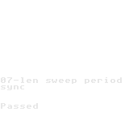
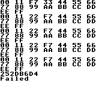
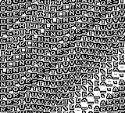
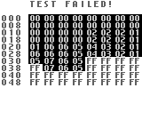
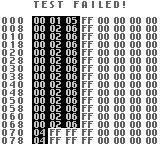

## Blargg's tests

https://github.com/retrio/gb-test-roms

Some of those tests are skipped, see `blarggs_tests.rs` why.

| Test                                                             | Result |
| ---------------------------------------------------------------- | ------ |
| roms/gb-test-roms/cpu_instrs/cpu_instrs.gb                       | ✅     |
| roms/gb-test-roms/cpu_instrs/individual/01-special.gb            | ✅     |
| roms/gb-test-roms/cpu_instrs/individual/02-interrupts.gb         | ✅     |
| roms/gb-test-roms/cpu_instrs/individual/03-op sp,hl.gb           | ✅     |
| roms/gb-test-roms/cpu_instrs/individual/04-op r,imm.gb           | ✅     |
| roms/gb-test-roms/cpu_instrs/individual/05-op rp.gb              | ✅     |
| roms/gb-test-roms/cpu_instrs/individual/06-ld r,r.gb             | ✅     |
| roms/gb-test-roms/cpu_instrs/individual/07-jr,jp,call,ret,rst.gb | ✅     |
| roms/gb-test-roms/cpu_instrs/individual/08-misc instrs.gb        | ✅     |
| roms/gb-test-roms/cpu_instrs/individual/09-op r,r.gb             | ✅     |
| roms/gb-test-roms/cpu_instrs/individual/10-bit ops.gb            | ✅     |
| roms/gb-test-roms/cpu_instrs/individual/11-op a,(hl).gb          | ✅     |
| roms/gb-test-roms/instr_timing/instr_timing.gb                   | ✅     |
| roms/gb-test-roms/mem_timing/individual/01-read_timing.gb        | ✅     |
| roms/gb-test-roms/mem_timing/individual/02-write_timing.gb       | ✅     |
| roms/gb-test-roms/mem_timing/individual/03-modify_timing.gb      | ✅     |
| roms/gb-test-roms/mem_timing/mem_timing.gb                       | ✅     |

## Blargg's tests - dmg_sound

https://github.com/retrio/gb-test-roms

| Name                     | Expected                                   | Result                                   | Diff                                   | Status        |
| ------------------------ | ------------------------------------------ | ---------------------------------------- | -------------------------------------- | ------------- |
| 01-registers             |              |              |              | ✅ Diff: 0    |
| 02-len_ctr               |                |                |                | ✅ Diff: 0    |
| 03-trigger               |                |                |                | ✅ Diff: 0    |
| 04-sweep                 |                  |                  |                  | ✅ Diff: 0    |
| 05-sweep_details         |          |          |          | ✅ Diff: 0    |
| 06-overflow_on_trigger   |    |    |    | ✅ Diff: 0    |
| 07-len_sweep_period_sync |  |  |  | ✅ Diff: 0    |
| 08-len_ctr_during_power  |   |   |   | ✅ Diff: 0    |
| 09-wave_read_while_on    |     |     |     | ❌ Diff: 3433 |
| 10-wave_trigger_while_on |  |  |  | ❌ Diff: 290  |
| 11-regs_after_power      |       |       |       | ✅ Diff: 0    |
| 12-wave_write_while_on   |    |    |    | ❌ Diff: 549  |

## Mooneye Test Suite

https://github.com/Gekkio/mooneye-test-suite

Only DMG compatible tests used.

| Test                                                                         | Result |
| ---------------------------------------------------------------------------- | ------ |
| roms/mooneye-test-suite/build/acceptance/add_sp_e_timing.gb                  | ✅     |
| roms/mooneye-test-suite/build/acceptance/bits/mem_oam.gb                     | ✅     |
| roms/mooneye-test-suite/build/acceptance/bits/reg_f.gb                       | ✅     |
| roms/mooneye-test-suite/build/acceptance/bits/unused_hwio-GS.gb              | ✅     |
| roms/mooneye-test-suite/build/acceptance/boot_div-dmgABCmgb.gb               | ✅     |
| roms/mooneye-test-suite/build/acceptance/boot_hwio-dmgABCmgb.gb              | ✅     |
| roms/mooneye-test-suite/build/acceptance/boot_regs-dmgABC.gb                 | ✅     |
| roms/mooneye-test-suite/build/acceptance/call_cc_timing.gb                   | ✅     |
| roms/mooneye-test-suite/build/acceptance/call_cc_timing2.gb                  | ✅     |
| roms/mooneye-test-suite/build/acceptance/call_timing.gb                      | ✅     |
| roms/mooneye-test-suite/build/acceptance/call_timing2.gb                     | ✅     |
| roms/mooneye-test-suite/build/acceptance/di_timing-GS.gb                     | ✅     |
| roms/mooneye-test-suite/build/acceptance/div_timing.gb                       | ✅     |
| roms/mooneye-test-suite/build/acceptance/ei_sequence.gb                      | ✅     |
| roms/mooneye-test-suite/build/acceptance/ei_timing.gb                        | ✅     |
| roms/mooneye-test-suite/build/acceptance/halt_ime0_ei.gb                     | ✅     |
| roms/mooneye-test-suite/build/acceptance/halt_ime0_nointr_timing.gb          | ✅     |
| roms/mooneye-test-suite/build/acceptance/halt_ime1_timing.gb                 | ✅     |
| roms/mooneye-test-suite/build/acceptance/halt_ime1_timing2-GS.gb             | ✅     |
| roms/mooneye-test-suite/build/acceptance/if_ie_registers.gb                  | ✅     |
| roms/mooneye-test-suite/build/acceptance/instr/daa.gb                        | ✅     |
| roms/mooneye-test-suite/build/acceptance/interrupts/ie_push.gb               | ✅     |
| roms/mooneye-test-suite/build/acceptance/intr_timing.gb                      | ✅     |
| roms/mooneye-test-suite/build/acceptance/jp_cc_timing.gb                     | ✅     |
| roms/mooneye-test-suite/build/acceptance/jp_timing.gb                        | ✅     |
| roms/mooneye-test-suite/build/acceptance/ld_hl_sp_e_timing.gb                | ✅     |
| roms/mooneye-test-suite/build/acceptance/oam_dma/basic.gb                    | ✅     |
| roms/mooneye-test-suite/build/acceptance/oam_dma/reg_read.gb                 | ✅     |
| roms/mooneye-test-suite/build/acceptance/oam_dma/sources-GS.gb               | ✅     |
| roms/mooneye-test-suite/build/acceptance/oam_dma_restart.gb                  | ✅     |
| roms/mooneye-test-suite/build/acceptance/oam_dma_start.gb                    | ✅     |
| roms/mooneye-test-suite/build/acceptance/oam_dma_timing.gb                   | ✅     |
| roms/mooneye-test-suite/build/acceptance/pop_timing.gb                       | ✅     |
| roms/mooneye-test-suite/build/acceptance/ppu/hblank_ly_scx_timing-GS.gb      | ✅     |
| roms/mooneye-test-suite/build/acceptance/ppu/intr_1_2_timing-GS.gb           | ✅     |
| roms/mooneye-test-suite/build/acceptance/ppu/intr_2_0_timing.gb              | ✅     |
| roms/mooneye-test-suite/build/acceptance/ppu/intr_2_mode0_timing.gb          | ✅     |
| roms/mooneye-test-suite/build/acceptance/ppu/intr_2_mode0_timing_sprites.gb  | ❌     |
| roms/mooneye-test-suite/build/acceptance/ppu/intr_2_mode3_timing.gb          | ✅     |
| roms/mooneye-test-suite/build/acceptance/ppu/intr_2_oam_ok_timing.gb         | ✅     |
| roms/mooneye-test-suite/build/acceptance/ppu/lcdon_timing-GS.gb              | ✅     |
| roms/mooneye-test-suite/build/acceptance/ppu/lcdon_write_timing-GS.gb        | ✅     |
| roms/mooneye-test-suite/build/acceptance/ppu/stat_irq_blocking.gb            | ✅     |
| roms/mooneye-test-suite/build/acceptance/ppu/stat_lyc_onoff.gb               | ✅     |
| roms/mooneye-test-suite/build/acceptance/ppu/vblank_stat_intr-GS.gb          | ✅     |
| roms/mooneye-test-suite/build/acceptance/push_timing.gb                      | ✅     |
| roms/mooneye-test-suite/build/acceptance/rapid_di_ei.gb                      | ✅     |
| roms/mooneye-test-suite/build/acceptance/ret_cc_timing.gb                    | ✅     |
| roms/mooneye-test-suite/build/acceptance/ret_timing.gb                       | ✅     |
| roms/mooneye-test-suite/build/acceptance/reti_intr_timing.gb                 | ✅     |
| roms/mooneye-test-suite/build/acceptance/reti_timing.gb                      | ✅     |
| roms/mooneye-test-suite/build/acceptance/rst_timing.gb                       | ✅     |
| roms/mooneye-test-suite/build/acceptance/serial/boot_sclk_align-dmgABCmgb.gb | ❌     |
| roms/mooneye-test-suite/build/acceptance/timer/div_write.gb                  | ✅     |
| roms/mooneye-test-suite/build/acceptance/timer/rapid_toggle.gb               | ✅     |
| roms/mooneye-test-suite/build/acceptance/timer/tim00.gb                      | ✅     |
| roms/mooneye-test-suite/build/acceptance/timer/tim00_div_trigger.gb          | ✅     |
| roms/mooneye-test-suite/build/acceptance/timer/tim01.gb                      | ✅     |
| roms/mooneye-test-suite/build/acceptance/timer/tim01_div_trigger.gb          | ✅     |
| roms/mooneye-test-suite/build/acceptance/timer/tim10.gb                      | ✅     |
| roms/mooneye-test-suite/build/acceptance/timer/tim10_div_trigger.gb          | ✅     |
| roms/mooneye-test-suite/build/acceptance/timer/tim11.gb                      | ✅     |
| roms/mooneye-test-suite/build/acceptance/timer/tim11_div_trigger.gb          | ✅     |
| roms/mooneye-test-suite/build/acceptance/timer/tima_reload.gb                | ✅     |
| roms/mooneye-test-suite/build/acceptance/timer/tima_write_reloading.gb       | ✅     |
| roms/mooneye-test-suite/build/acceptance/timer/tma_write_reloading.gb        | ✅     |
| roms/mooneye-test-suite/build/emulator-only/mbc1/bits_bank1.gb               | ✅     |
| roms/mooneye-test-suite/build/emulator-only/mbc1/bits_bank2.gb               | ✅     |
| roms/mooneye-test-suite/build/emulator-only/mbc1/bits_mode.gb                | ✅     |
| roms/mooneye-test-suite/build/emulator-only/mbc1/bits_ramg.gb                | ✅     |
| roms/mooneye-test-suite/build/emulator-only/mbc1/multicart_rom_8Mb.gb        | ❌     |
| roms/mooneye-test-suite/build/emulator-only/mbc1/ram_256kb.gb                | ✅     |
| roms/mooneye-test-suite/build/emulator-only/mbc1/ram_64kb.gb                 | ✅     |
| roms/mooneye-test-suite/build/emulator-only/mbc1/rom_16Mb.gb                 | ✅     |
| roms/mooneye-test-suite/build/emulator-only/mbc1/rom_1Mb.gb                  | ✅     |
| roms/mooneye-test-suite/build/emulator-only/mbc1/rom_2Mb.gb                  | ✅     |
| roms/mooneye-test-suite/build/emulator-only/mbc1/rom_4Mb.gb                  | ✅     |
| roms/mooneye-test-suite/build/emulator-only/mbc1/rom_512kb.gb                | ✅     |
| roms/mooneye-test-suite/build/emulator-only/mbc1/rom_8Mb.gb                  | ✅     |
| roms/mooneye-test-suite/build/emulator-only/mbc2/bits_ramg.gb                | ✅     |
| roms/mooneye-test-suite/build/emulator-only/mbc2/bits_romb.gb                | ✅     |
| roms/mooneye-test-suite/build/emulator-only/mbc2/bits_unused.gb              | ✅     |
| roms/mooneye-test-suite/build/emulator-only/mbc2/ram.gb                      | ✅     |
| roms/mooneye-test-suite/build/emulator-only/mbc2/rom_1Mb.gb                  | ✅     |
| roms/mooneye-test-suite/build/emulator-only/mbc2/rom_2Mb.gb                  | ✅     |
| roms/mooneye-test-suite/build/emulator-only/mbc2/rom_512kb.gb                | ✅     |
| roms/mooneye-test-suite/build/emulator-only/mbc5/rom_16Mb.gb                 | ✅     |
| roms/mooneye-test-suite/build/emulator-only/mbc5/rom_1Mb.gb                  | ✅     |
| roms/mooneye-test-suite/build/emulator-only/mbc5/rom_2Mb.gb                  | ✅     |
| roms/mooneye-test-suite/build/emulator-only/mbc5/rom_32Mb.gb                 | ✅     |
| roms/mooneye-test-suite/build/emulator-only/mbc5/rom_4Mb.gb                  | ✅     |
| roms/mooneye-test-suite/build/emulator-only/mbc5/rom_512kb.gb                | ✅     |
| roms/mooneye-test-suite/build/emulator-only/mbc5/rom_64Mb.gb                 | ✅     |
| roms/mooneye-test-suite/build/emulator-only/mbc5/rom_8Mb.gb                  | ✅     |
| roms/mooneye-test-suite/build/madness/mgb_oam_dma_halt_sprites.gb            | ❌     |
| roms/mooneye-test-suite/build/manual-only/sprite_priority.gb                 | ❌     |
| roms/mooneye-test-suite/build/utils/bootrom_dumper.gb                        | ❌     |
| roms/mooneye-test-suite/build/utils/dump_boot_hwio.gb                        | ✅     |

## Wilbertpol's tests

From https://github.com/vojty/wilbertpol-test-suite

| Test                                                                                     | Result |
| ---------------------------------------------------------------------------------------- | ------ |
| roms/wilbertpol-test-suite/build/acceptance/gpu/hblank_ly_scx_timing_nops.gb             | ❌     |
| roms/wilbertpol-test-suite/build/acceptance/gpu/hblank_ly_scx_timing_variant_nops.gb     | ❌     |
| roms/wilbertpol-test-suite/build/acceptance/gpu/intr_0_timing.gb                         | ✅     |
| roms/wilbertpol-test-suite/build/acceptance/gpu/intr_1_timing.gb                         | ✅     |
| roms/wilbertpol-test-suite/build/acceptance/gpu/intr_2_mode0_scx1_timing_nops.gb         | ✅     |
| roms/wilbertpol-test-suite/build/acceptance/gpu/intr_2_mode0_scx2_timing_nops.gb         | ✅     |
| roms/wilbertpol-test-suite/build/acceptance/gpu/intr_2_mode0_scx3_timing_nops.gb         | ✅     |
| roms/wilbertpol-test-suite/build/acceptance/gpu/intr_2_mode0_scx4_timing_nops.gb         | ❌     |
| roms/wilbertpol-test-suite/build/acceptance/gpu/intr_2_mode0_scx5_timing_nops.gb         | ✅     |
| roms/wilbertpol-test-suite/build/acceptance/gpu/intr_2_mode0_scx6_timing_nops.gb         | ✅     |
| roms/wilbertpol-test-suite/build/acceptance/gpu/intr_2_mode0_scx7_timing_nops.gb         | ✅     |
| roms/wilbertpol-test-suite/build/acceptance/gpu/intr_2_mode0_scx8_timing_nops.gb         | ❌     |
| roms/wilbertpol-test-suite/build/acceptance/gpu/intr_2_mode0_timing_sprites_nops.gb      | ❌     |
| roms/wilbertpol-test-suite/build/acceptance/gpu/intr_2_mode0_timing_sprites_scx1_nops.gb | ❌     |
| roms/wilbertpol-test-suite/build/acceptance/gpu/intr_2_mode0_timing_sprites_scx2_nops.gb | ❌     |
| roms/wilbertpol-test-suite/build/acceptance/gpu/intr_2_mode0_timing_sprites_scx3_nops.gb | ❌     |
| roms/wilbertpol-test-suite/build/acceptance/gpu/intr_2_mode0_timing_sprites_scx4_nops.gb | ❌     |
| roms/wilbertpol-test-suite/build/acceptance/gpu/intr_2_timing.gb                         | ❌     |
| roms/wilbertpol-test-suite/build/acceptance/gpu/lcdon_mode_timing.gb                     | ✅     |
| roms/wilbertpol-test-suite/build/acceptance/gpu/ly00_01_mode0_2.gb                       | ✅     |
| roms/wilbertpol-test-suite/build/acceptance/gpu/ly00_mode0_2-GS.gb                       | ✅     |
| roms/wilbertpol-test-suite/build/acceptance/gpu/ly00_mode1_0-GS.gb                       | ✅     |
| roms/wilbertpol-test-suite/build/acceptance/gpu/ly00_mode2_3.gb                          | ✅     |
| roms/wilbertpol-test-suite/build/acceptance/gpu/ly00_mode3_0.gb                          | ✅     |
| roms/wilbertpol-test-suite/build/acceptance/gpu/ly143_144_145.gb                         | ✅     |
| roms/wilbertpol-test-suite/build/acceptance/gpu/ly143_144_152_153.gb                     | ✅     |
| roms/wilbertpol-test-suite/build/acceptance/gpu/ly143_144_mode0_1.gb                     | ✅     |
| roms/wilbertpol-test-suite/build/acceptance/gpu/ly143_144_mode3_0.gb                     | ✅     |
| roms/wilbertpol-test-suite/build/acceptance/gpu/ly_lyc-GS.gb                             | ✅     |
| roms/wilbertpol-test-suite/build/acceptance/gpu/ly_lyc_0-GS.gb                           | ✅     |
| roms/wilbertpol-test-suite/build/acceptance/gpu/ly_lyc_0_write-GS.gb                     | ✅     |
| roms/wilbertpol-test-suite/build/acceptance/gpu/ly_lyc_144-GS.gb                         | ✅     |
| roms/wilbertpol-test-suite/build/acceptance/gpu/ly_lyc_153-GS.gb                         | ✅     |
| roms/wilbertpol-test-suite/build/acceptance/gpu/ly_lyc_153_write-GS.gb                   | ✅     |
| roms/wilbertpol-test-suite/build/acceptance/gpu/ly_lyc_write-GS.gb                       | ✅     |
| roms/wilbertpol-test-suite/build/acceptance/gpu/ly_new_frame-GS.gb                       | ✅     |
| roms/wilbertpol-test-suite/build/acceptance/gpu/stat_write_if-GS.gb                      | ❌     |
| roms/wilbertpol-test-suite/build/acceptance/gpu/vblank_if_timing.gb                      | ✅     |
| roms/wilbertpol-test-suite/build/acceptance/timer/timer_if.gb                            | ❌     |

## acid2 tests

- https://github.com/mattcurrie/dmg-acid2
- https://github.com/mattcurrie/cgb-acid2

| Name      | Expected                    | Result                    | Diff                    | Status     |
| --------- | --------------------------- | ------------------------- | ----------------------- | ---------- |
| dmg-acid2 |  |  |  | ✅ Diff: 0 |
| cgb-acid2 |  |  |  | ✅ Diff: 0 |

## Scribbltests

https://github.com/Hacktix/scribbltests

| Name      | Expected                    | Result                    | Diff                    | Status     |
| --------- | --------------------------- | ------------------------- | ----------------------- | ---------- |
| scxly     |      |      |      | ✅ Diff: 0 |
| lycscx    |     |     |     | ✅ Diff: 0 |
| lycscy    |     |     |     | ✅ Diff: 0 |
| palettely |  |  |  | ✅ Diff: 0 |
| statcount |  |  |  | ✅ Diff: 0 |

## TurtleTests

https://github.com/Powerlated/TurtleTests

| Name                          | Expected                                        | Result                                        | Diff                                        | Status     |
| ----------------------------- | ----------------------------------------------- | --------------------------------------------- | ------------------------------------------- | ---------- |
| window_y_trigger              |               |               |               | ✅ Diff: 0 |
| window_y_trigger_wx_offscreen |  |  |  | ✅ Diff: 0 |

## MBC3-Tester

https://github.com/EricKirschenmann/MBC3-Tester-gb

| Name        | Expected                      | Result                      | Diff                      | Status     |
| ----------- | ----------------------------- | --------------------------- | ------------------------- | ---------- |
| MBC3-Tester |  |  |  | ✅ Diff: 0 |

## Mealybug Tearoom Tests

https://github.com/mattcurrie/mealybug-tearoom-tests

| Name                              | Expected                                            | Result                                            | Diff                                            | Status         |
| --------------------------------- | --------------------------------------------------- | ------------------------------------------------- | ----------------------------------------------- | -------------- |
| m2_win_en_toggle                  |                   |                   |                   | ✅ Diff: 0     |
| m3_bgp_change                     |                      |                      |                      | ❌ Diff: 2927  |
| m3_bgp_change_sprites             |              |              |              | ❌ Diff: 9346  |
| m3_lcdc_bg_en_change              |               |               |               | ❌ Diff: 3457  |
| m3_lcdc_bg_map_change             |              |              |              | ❌ Diff: 2386  |
| m3_lcdc_obj_en_change             |              |              |              | ❌ Diff: 146   |
| m3_lcdc_obj_en_change_variant     |      |      |      | ❌ Diff: 1334  |
| m3_lcdc_obj_size_change           |            |            |            | ❌ Diff: 309   |
| m3_lcdc_obj_size_change_scx       |        |        |        | ❌ Diff: 190   |
| m3_lcdc_tile_sel_change           |            |            |            | ❌ Diff: 2574  |
| m3_lcdc_tile_sel_win_change       |        |        |        | ❌ Diff: 2741  |
| m3_lcdc_win_en_change_multiple    |     |     |     | ❌ Diff: 8169  |
| m3_lcdc_win_en_change_multiple_wx |  |  |  | ❌ Diff: 4966  |
| m3_lcdc_win_map_change            |             |             |             | ❌ Diff: 2052  |
| m3_obp0_change                    |                     |                     |                     | ❌ Diff: 414   |
| m3_scx_high_5_bits                |                 |                 |                 | ❌ Diff: 6426  |
| m3_scx_low_3_bits                 |                  |                  |                  | ❌ Diff: 540   |
| m3_scy_change                     |                      |                      |                      | ❌ Diff: 8750  |
| m3_window_timing                  |                   |                   |                   | ❌ Diff: 665   |
| m3_window_timing_wx_0             |              |              |              | ❌ Diff: 954   |
| m3_wx_4_change                    |                     |                     |                     | ❌ Diff: 229   |
| m3_wx_4_change_sprites            |             |             |             | ❌ Diff: 10    |
| m3_wx_5_change                    |                     |                     |                     | ❌ Diff: 638   |
| m3_wx_6_change                    |                     |                     |                     | ❌ Diff: 13799 |

## AGE test suite

Only DMG-related tests for now. From https://github.com/c-sp/age-test-roms

| Test                                                                        | Result | Screenshot                                                 |
| --------------------------------------------------------------------------- | ------ | ---------------------------------------------------------- |
| roms/age-test-roms/build/halt/ei-halt-dmgC-cgbBCE.gb                        | ❌     |            |
| roms/age-test-roms/build/halt/halt-m0-interrupt-dmgC-cgbBCE.gb              | ❌     |  |
| roms/age-test-roms/build/halt/halt-prefetch-dmgC-cgbBCE.gb                  | ✅     |      |
| roms/age-test-roms/build/ly/ly-dmgC-cgbBC.gb                                | ✅     |                  |
| roms/age-test-roms/build/oam/oam-read-dmgC-cgbBC.gb                         | ❌     |            |
| roms/age-test-roms/build/oam/oam-write-dmgC.gb                              | ❌     |                 |
| roms/age-test-roms/build/stat-interrupt/stat-int-dmgC-cgbBCE.gb             | ❌     |           |
| roms/age-test-roms/build/stat-mode/stat-mode-dmgC-cgbBC.gb                  | ❌     |           |
| roms/age-test-roms/build/stat-mode-sprites/stat-mode-sprites-dmgC-cgbBCE.gb | ❌     |  |
| roms/age-test-roms/build/stat-mode-window/stat-mode-window-dmgC.gb          | ❌     |          |
| roms/age-test-roms/build/vram/vram-read-dmgC.gb                             | ❌     |                 |

Generated at: 2023-05-20 18:53:42.497328 UTC, took 2s
